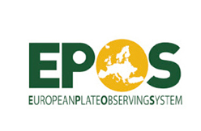

As a major solid Earth science infrastructure, [EPOS](http://www.epos-eu.org/) was recently included in the [EGI Competence Centers call](http://www.egi.eu/blog/2014/06/03/the_call_for_egi_engage_competence_centres_is_open.html), where it will develop a pilot to test selected [EGI](https://www.egi.eu/) technologies, including solutions for implementing [AAAI](http://www.mysecurecyberspace.com/encyclopedia/index/authentication-authorization-accounting-aaa.html).

**[My article](http://www.danielebailo.it/wp-content/uploads/2015/02/Issue_number_18.pdf) in the EGI newsletter briefly explains what EPOS is and outlines possible areas of collaboration with EGI.**

 

**[Link to the online article](http://www.egi.eu/news-and-media/newsletters/Inspired_Issue_18/epos.html) [Link to the full EGI newsletter issue](http://go.egi.eu/Issue18PDF) (PDF)**
