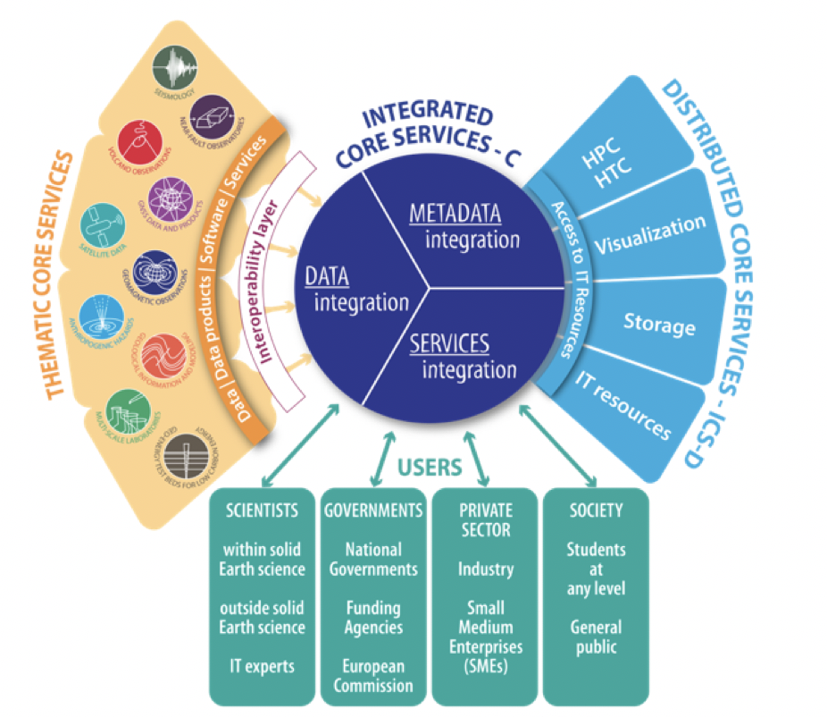
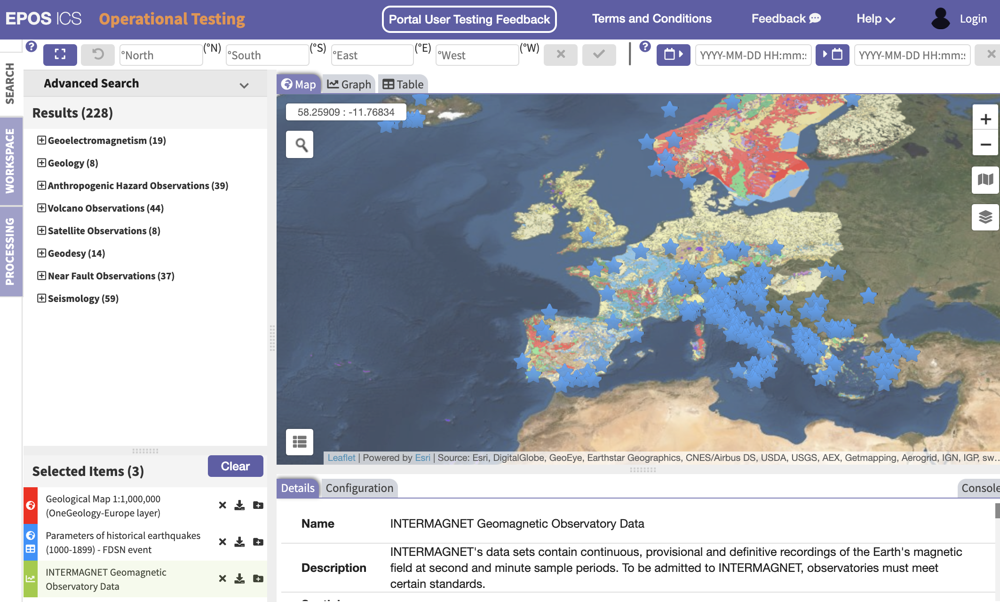

**There are moments when, sometimes almost unexpectedly, you find yourself taking stock of all the work done in previous years.**

That kind of meticulous work, made of small daily refinements and microscopic steps forward that you may not even notice. In fact, sometimes it feels as if you are standing still. Then opportunities arrive when... BOOM... everything is illuminated by a new light and the puzzle comes together.

What emerges is a beautiful mosaic, with thousands of tiny tiles placed with patience and consistency.

This is what happened today during the presentation of the work carried out over the last few years at the ICT INGV 2021 meeting. It was work done with fantastic colleagues: some present from the beginning, others who arrived and left, others who have just come on board. **A remarkable team effort, one we can be proud of.**

So what was done? Below I report the abstract and presentation as presented at the conference.

The presentation is available here: [https://doi.org/10.5281/zenodo.5552787](https://doi.org/10.5281/zenodo.5552787)

**Abstract**

The integration of resources distributed across different European data centers and research infrastructures has become, over the last decade, a necessary step for efficiently conducting multidisciplinary research in the field of Earth sciences.

The integration of heterogeneous resources requires, on the one hand, "transparent access to shared knowledge and data", which is one definition of "Open Science" \[1\], from open data providers. On the other hand, it requires data providers to manage data through technological infrastructures developed in accordance with the FAIR principles \[2\].

Within this framework, EPOS ([www.epos-eu.org](http://www.epos-eu.org/)), the European Plate Observing System, is positioned as a pan-European research infrastructure on the ESFRI roadmap (European Strategic Forum on Research Infrastructures), and has recently been granted ERIC status (European Research Infrastructure Consortium).

EPOS aims to integrate the different European research infrastructures for solid Earth science according to the FAIR principles.

The architecture enabling this integration consists of two main layers: on one side, an integration node accessible through the EPOS Data Portal; on the other, the TCSs (Thematic Core Services), which provide data from specific scientific domains such as seismology, volcanology, satellite data, geodesy, anthropogenic hazards, geo-electromagnetism, geology, and near-fault observatories.

The integration node accessible from the EPOS Data Portal was designed according to the FAIR principles. It is easy to maintain and scale thanks to the adoption of a modular, atomic, and interoperable microservices approach. In particular, one of the keys to promoting interoperability is the use of rich metadata, implemented through two standards: EPOS-DCAT-AP \[3\] for metadata transfer, and CERIF \[4\] for metadata storage. The microservices approach was implemented using technologies such as RabbitMQ \[5\] to enable communication among individual microservices, and Docker for virtualization within a DevOps deployment method implemented with GitLab CI/CD \[6\].

In this contribution, we present an overview of the main technical aspects of the EPOS architecture, the general approach to data management, how the FAIR principles have been implemented, and a multidisciplinary use case demonstrating the integration of data and products through the EPOS Data Portal.

\[1\] R. Vicente-Saez, C. Martinez-Fuentes, Open Science now: A systematic literature review for an integrated definition, J. Bus. Res. 88 (2018) 428-436. doi:10.1016/j.jbusres.2017.12.043

\[2\] [https://www.force11.org/group/fairgroup/fairprinciples](https://www.force11.org/group/fairgroup/fairprinciples)

\[3\] Luca Trani, Malcolm Atkinson, Daniele Bailo, Rossana Paciello, Rosa Filgueira Establishing Core Concepts for Information-Powered Collaborations,.. Future Generation Computer Systems, Volume 89, 2018, Pages 421-437, ISSN 0167-739X, [https://doi.org/10.1016/j.future.2018.07.005](https://doi.org/10.1016/j.future.2018.07.005)

\[4\] CERIF - the Common European Research Information Format - is a conceptual model describing the Research domain [https://www.eurocris.org/eurocris\_archive/cerifsupport.org/cerif-in-brief/index.html](https://www.eurocris.org/eurocris_archive/cerifsupport.org/cerif-in-brief/index.html)

\[5\] [https://www.rabbitmq.com/](https://www.rabbitmq.com/)

\[6\] Bailo D. et al., (2018). Integration of heterogeneous data, software and services in Solid Earth Sciences: the EPOS system design and roadmap for the building of Integrated Core Services. Rapp. Tec. INGV, 393: 1- 22, ISSN 2039-7941.
