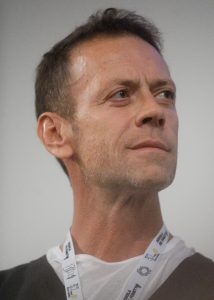
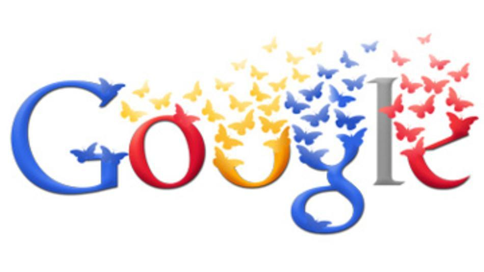

What does Rocco Siffredi have to do with Google and technology?

The common point is clear: the display of enormous power, sexual in one case and computational in the other. I leave it to the reader to guess which one is Google and which one is Siffredi.

The parallel appeared very clearly in my mind when I listened to a talk here at [EGU](http://www.egu2013.eu/) ([read this post to discover what EGU is](http://danielebailo.wordpress.com/2013/04/10/un-congresso-di-geoscienziati-alias-egu-1/)) about Google's new search and computation engine for Earth sciences, [EarthEngine](http://earthengine.google.org/).

IMAGE By Niccolo Caranti (Own work) [CC BY-SA 4.0 (http://creativecommons.org/licenses/by-sa/4.0)], via Wikimedia Commons

<!--more-->

A guy arrives in jeans and a black T-shirt, confident and relaxed, as if he were heading to the pub for a beer with friends.

Then he begins: "my presentation will not be like the ones you have seen so far." Of course, he immediately has to be different. And he continues: "**for fifteen years I worked in research doing things the wrong way. Now I have joined Google and started doing things the right way**." Damn. Who are you? He goes on: "at Google we start from **a simple assumption: computing power and storage capacity are infinite resources, for us**."

Fine... if you want to show that you are the coolest, why not come here and give each of us 50 euros?

The rest of the talk is easy to imagine: a parade of the fantastic features of the online software they had created. In everything he said, in his language, body language, tone of voice, and posture, this simple and incontestable truth, for them, came through: they are the coolest, and Google, worshipped almost like a deity, is good, generous, loves us, and above all is stronger than everyone. Nobody will destroy it, it does beautiful things, it is beautiful to work there, and it is beautiful to use it. _Google and Ken Shiro. Google and Rocco Siffredi._

At the end, during the questions, the guy became almost aggressive. Example: Question: "what assurance do we have that the service will still be active in ten years?" Answer from the Google guy: "none" ....silence.... Then he resumed: "_what assurance do you have that you will still be alive in two years?_" .... I wanted to touch iron.

Now, to avoid hypocrisy, I admit that Google seems attractive to me too. I wonder what it would be like to work there, not only because I imagine the salaries are high, but also because when you work with Google you know you are working for a company that represents the best the market has to offer.

However, one disturbing element that makes me think, among many others, is the reverence with which Google employees talk about it. At times it really seems to be God for them. There is something religious in the way they describe or refer to it.

The guy then left after the canonical fifteen minutes dedicated to presentations, inviting the whole audience to visit their stand for a demonstration of EarthEngine. I went there, and it does indeed do beautiful things, but it leaves me doubtful when I think about how much a scientist can actually use it. In fact, both the strength and the limitation of Google products is that they **create technologies that work extremely well and are very simple, but have limited flexibility**. Google Search itself is exceptional, especially now that autocomplete seems to read your mind, but _if I wanted, for example, a list of pages containing a personal biography of every person named "Ignazio", things would become more complex: I would receive tons of results and then have to select them manually_. **For complex searches it is therefore not very suitable:** this is why I remain somewhat hesitant about the possible use of a tool like EarthEngine.

Time will tell.

In the meantime, their Rocco-Siffredi-ness will remain unchanged, perhaps even increase together with the enormous size of everything they have: computing, storage, users. All we can do is be aware of it and not be deceived by size, which matters a little, but is not everything.
