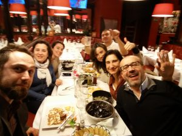

> This post is simply an homage to my new Spanish friends. The story is straightforward.

As often happens, I found myself in Brussels for work. This time it was only for one day, so I arrived the evening before the meeting and wandered around the city on my own. I went for a beer at the wonderful [Delirium Café](http://deliriumcafe.be/), where I met three Spanish people. It was very easy to start talking with them. We Italians and Spaniards do not usually have much trouble connecting with other people and starting a conversation. On the contrary, the problem is often making us stop talking, but that is another story.

To make a long story short, the three Spaniards were part of a larger group, mostly from Madrid and Extremadura ([Merida](https://www.google.be/search?q=MERIDA+spain&biw=1178&bih=774&noj=1&tbm=isch&tbo=u&source=univ&sa=X&ved=0ahUKEwiet_OpqOnKAhWDIQ8KHS3dBWQQsAQIKw)). They were a group of friends who, once a year during Carnival, take a few days off and visit a European city together. Wonderful, simply wonderful. I could also practice my Spanish, which apparently is not dead, although the real mystery remains: where on earth did I learn Spanish? I cannot remember, but it does not matter. In the end we had dinner together, and they were so kind that they even paid for it. Great.

My friends, you definitely deserve special hospitality in Rome. Please come soon.

**PS: Special greetings to Manolo and Manola!!**

UPDATE PPS: as noted by Nice, maybe I learned Spanish in Escobar del Campos (joder!).
