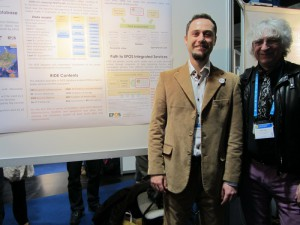

This photo deserves to be at the center of the page. It is memorable.

**Why? I will explain immediately:** anyone with a scientific eye will already have understood that I was presenting a poster. I was at [EGU](http://danielebailo.wordpress.com/2013/04/10/un-congresso-di-geoscienziati-alias-egu-1/ "Un congresso di geoscienziati? (alias: EGU #1)") in Vienna. The guy next to me, wearing purple trousers, a black shirt, a black silk scarf with white doves, and a biker-style jacket, and I assure you that the hair is not a wig but real 1970s hair, may look like a hippie picked up at the last minute from the city streets. In reality, he is a great mind, and is seriously at risk of becoming my IT guru: _his name is Keith J. Jeffery_. He is a true heavyweight in European IT architectures, with many titles. An excerpt from [one of his bios](http://www.stfc.ac.uk/Staff/5656.aspx) says: "_Keith Jeffery is currently Director of IT and International Strategy of STFC (Science and Technology Facilities Council), based at the Rutherford Appleton Laboratory (RAL) in the UK._" He also holds various other titles, director here, president there, has worked on Grid, now works on Cloud, and many other interesting things that I will skip.

Besides being very nice, eclectic, and singular, there are several other characteristics we share: he plays guitar and is a real rocker. But most of all, **he has a fascinating way of reasoning. He thinks systemically.** I am not sure whether this is how geniuses think, because I have personally met only a few, but they do indeed seem to think in similar ways.

While I was presenting the poster, he was there with me as a co-author. In the quiet moments between one conversation and another with people who wanted information about our charming and incomprehensible diagrams, we started drafting a work plan for the following months. That is when I saw genius at work. **It was wonderful: it felt like being back at university, in the days of theoretical computer science.**

**When planning the activities** needed to build the project's infrastructure, any ordinary nerd would have started by installing something and hacking around. He approached the matter from a completely different angle: "first of all, we need four models to fully describe the system," he explained to me, "one for users, one for data, one for resources, and one for processing." And he continued: "then we need to find the interfaces among the different models and examine user-system, system-system, and data-processing interactions"... and so on in that vein.

In the end, our Excel file contained a list of about fifty tasks, none of which was intelligible to a normal human being, and only a couple of which were understandable to a nerd, such as "install PostgreSQL". **Everything else dealt with abstract objects**, their interactions, and strategies to define them by first proposing a simplified schema, then asking the community for feedback, and finally putting the pieces together.

Of course, my neurons were chasing his, trying to capture as much as possible. After compiling the list, I subjected him to shock treatment: a good half hour of questions to make sure I had understood what we had just written. I pried open his skull with a can opener and found a mine. Exceptional.

Now all that remains is to work with him, learning as much as possible. And upgrading my way of thinking.

If I crash, I will reboot.
