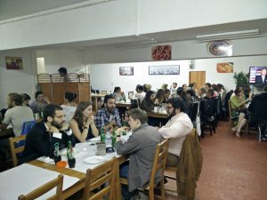
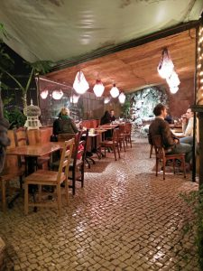

...but so do the men, children, elderly people... in short, everyone, including us: me and [Lucignolo](https://www.linkedin.com/in/alessandrospinuso), my trusted guide on trips abroad.

**So the question is: why all this special attention to the calf muscle?** Is it a Portuguese trait? Maybe. Is it simply my obsession? Yes, it is, but that is another matter. Is it this year's fashion? I do not think so.

The answer is that this attention to that part of the body is rooted in an initially painful experience: imagine arriving in the morning from the airport by public transport, armed with a trolley suitcase, yes, the good old days of the [Interrail backpack](http://blogstelsclub.com/wp-content/uploads/2011/09/huge-backpack.jpg) are over, and discovering that the road from the tram to the accommodation rises in an almost vertical direction. At first it looks like a sloping street full of cobblestones. Then you realize that the cobblestones, sworn enemies of the trolley suitcase, which must be carried on the shoulder if you do not want to destroy the wheels, gradually give way to an endless series of steps.

Steps. Stairs. Handrails. Marble curbs. And more steps. Little stairways. Rises. Curves. Cobblestones. Recesses. Protrusions. Flights of stairs. Staircases.

The road home winds through those narrow and characteristic alleys lined with tiled houses, doors opening onto unstable buildings, and small squares where locals are hanging around. And while breathlessness turns me blue, I try to admire this bundle of beauty.

When I reach the threshold of the accommodation, I drop the suitcase heavily on the cobblestone ground and lean against the doorframe to catch my breath, waiting for the blood to flow back toward my legs and irrigate my calves. At that point my colleague informs me that we are on the third floor. Without an elevator, of course.

Resigned to my fate, ready to have a pacemaker installed once back in Rome, I start the final stretch of my ascent, swearing that I will not move again for another 48 hours.

> And indeed, less than an hour later, just enough time for a shower, we were outside again, relentlessly walking the streets of Lisbon and avoiding tourist-clogged places like the plague.

Kilometers on foot up and down Lisbon's stairs, miles strolling along endless alleys, for all five days of the trip. Always carrying the weight of the working day on our shoulders, as if it were the Armadillo by [Zerocalcare](http://www.zerocalcare.it/). Since my time is running out, I will mention only two really nice places and attach some photos of Lisbon's holy stairways.

#### 1\. The illegal Chinese restaurant

One of those places where you wonder: how did they think of this? How did it occur to them? It is a completely normal apartment where walls have been knocked down to make room for... a Chinese restaurant. Everything is obviously illegal: you enter through a normal doorway, climb the stairs, and arrive in the room with the tables. A place out of this world, with good food. But Chinese food is still Chinese food, and at night the fried stuff made itself felt. [Here is a nice post explaining how to get there](http://lisbonadalbasso.blogspot.it/2011/10/ristorante-cinese-illegale.html)

#### [2\. Chapito a Mesa](http://chapito.org/)

This is a great classic: a small pub that also serves dinner, a nice place... but wait. Where is the entrance? It is actually a cultural center hosting shows and artistic performances. Prices are good, the place has character, and in any case you can Google it, plenty of people talk about it, so I will not repeat them :)

That seems to be everything, so I can say goodbye.

**By the way: by the end of the trip, my calves** had come back to life. I was bouncing up and down the stairways, my breath had improved, and my lungs had recovered their original volume. Good training, those stairs.

\[gallery type="rectangular" size="medium" ids="2349,2350,2351,2352,2353,2354,2355,2356,2357,2358,2359,2360,2361,2362,2363,2364,2365,2366" orderby="rand"\]
