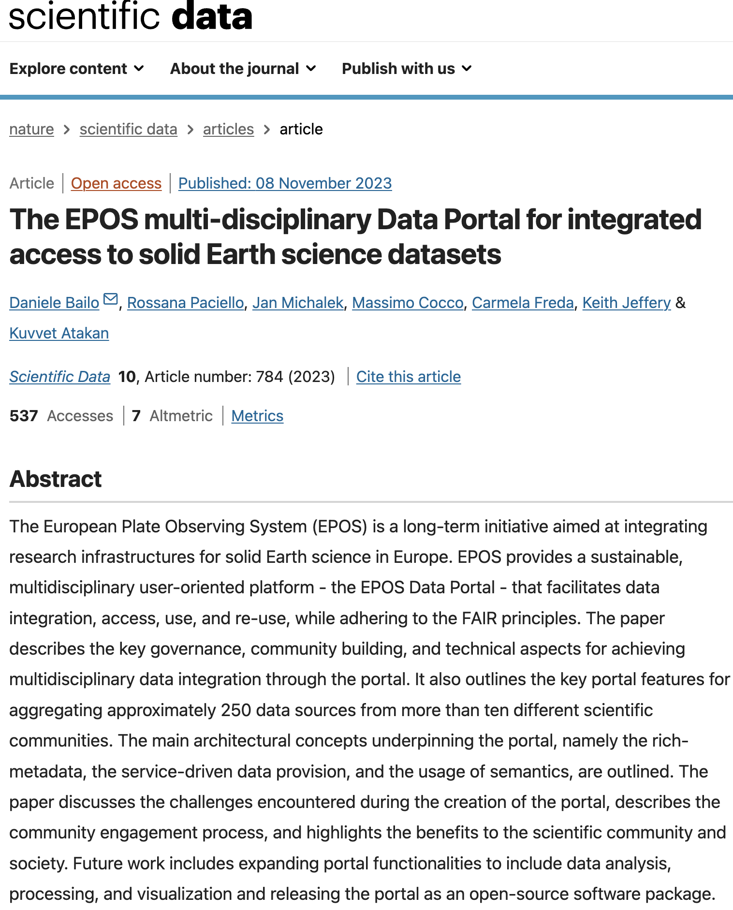

> In November 2023, [Nature Scientific Data](https://www.nature.com/articles/s41597-023-02697-9) published a scientific article presenting the data integration and computer science work that I carried out over the last 10 years together with a team of truly excellent colleagues. The article presents an initiative that is changing the way we approach Earth-science research in Europe: the [EPOS Data Portal](https://www.ics-c.epos-eu.org/). In this post, I will explain in accessible terms what makes this multidisciplinary platform so special.

The [European Plate Observing System (EPOS)](https://www.epos-eu.org/) is not just an international initiative; it is a vision that is redefining Earth science in Europe. This pioneering research infrastructure has built a unique collaborative environment where the sharing and use of scientific data are encouraged, supported, and carefully managed. [Open Data](https://www.forumpa.it/pa-digitale/open-data-cosa-sono-come-sfruttarli-e-stato-dellarte-in-italia/), in its purest spirit, allows everyone, scientists, policy makers, experts, and citizens, to access information freely. By adhering to the [FAIR](https://www.go-fair.org/fair-principles/) principles (Findable, Accessible, Interoperable, Reusable), EPOS is becoming a European reference point and a symbol of open and interoperable access to data. This approach not only opens new doors to knowledge, but is also a fundamental step toward more inclusive, collaborative, and innovative scientific research.

The role of the [Data Portal](https://www.ics-c.epos-eu.org/) is crucial: it is the beating heart of an ambitious enterprise that is changing the scientific research landscape. This platform represents a genuine revolution in the integration, access, and use of Earth-science data. Its strength lies in its **multidisciplinary nature, which allows data from more than 250 different sources to be aggregated**, offering a panoramic view of the Earth as never before. This extraordinary feature turns the Data Portal into a place where researchers, scientists, and professionals from various disciplines can access a vast wealth of information, while also collaborating and creating new synergies. In this way, the EPOS Data Portal goes beyond a simple data platform and becomes an incubator of ideas and discoveries, contributing significantly to our understanding of planet Earth.

**At the beginning, this undertaking seemed impossible.** Data as different as maps, file lists, and waveforms, each with different formats and different access standards. The dream of creating a portal seemed like pure utopia. But the continuous search for innovative solutions eventually produced results across several dimensions: first, technically, through the adoption of an innovative distributed architecture; second, at community level, through a community of around 1,000 people, including scientists, developers, engineers, computer scientists, data experts, and managers, brought together through intense meetings, community building, and innovative approaches such as [shape-up](https://www.danielebailo.it/job/the-agile-shape-up-method-for-collaborative-developments-in-international-contextsa-lean-approach-for-epos/); and finally, through continuous work at European level to ensure the sustainability of the infrastructure by participating in European projects and initiatives. 

The [EPOS Data Portal architecture](https://link.springer.com/chapter/10.1007/978-3-031-39141-5_20) is the foundation on which this innovative **open-source platform** rests. In addition to being inspired by state-of-the-art principles for multi-tier architectures, such as the microservices approach, it implements three key principles in a single innovative system: a) the use of rich, standards-based metadata, which allow resources to be described to the centralized system while leaving data ownership and management fully under the responsibility of data providers; b) service-based data access, which makes it possible to concentrate distributed resources from across the European continent in a single central hub, the EPOS Portal; c) the use of semantics, which assigns meaning and context to data and informs the central system about how data should be integrated on the map.

**As an [open-source platform](https://epos-eu.github.io/epos-open-source/),** the EPOS Data Portal opens the door to innovation and collaboration. It makes available to the global developer community software developed through 10 years of experience in data integration for solid Earth sciences, not only by software developers but by the entire scientific community actively involved in defining the portal's features and functionalities, ensuring that it responds to real user needs.

**For the scientific community,** the EPOS Data Portal is a valuable resource that simplifies access to and use of Earth-science data for multidisciplinary studies. It allows users to visualize combined data such as hazard maps, earthquakes from the last month, active faults in a specific region, and satellite images showing vertical displacement of the Earth's surface. This integration of multidisciplinary data provides a comprehensive view of seismic hazards in a region, helping us understand the processes that generate risk factors that can cause natural disasters such as earthquakes or volcanic eruptions.

**For politicians** and decision makers, multidisciplinary data can, in the long term, support informed decisions for safety and spatial planning.

**The EPOS Data Portal is destined to grow further.** The direction is toward the exploitation of **Big Data** through **Machine Learning and AI** techniques. Planned developments include expanding the portal's functionalities to enable advanced analysis, processing, and visualization of scientific data. This will open new opportunities for scientific discovery and innovation.

The [article in Nature Scientific Data](https://www.nature.com/articles/s41597-023-02697-9) represents only the beginning of a revolution in Earth science driven by the [EPOS Data Portal](https://www.ics-c.epos-eu.org/). This platform transforms the way we access and use data, opening new doors for research and collaboration. Imagine a future in which scientists, policy makers, and citizens draw on this vast resource to address the challenges of our planet: to access geological or seismic-hazard maps, or to understand whether the house they are buying will be safe in the long term. With the expansion toward Machine Learning and AI techniques applied to the Big Data integrated in the portal, EPOS is preparing to guide scientists toward potentially revolutionary discoveries. This exciting journey belongs to everyone, scientists, experts, and ordinary citizens, as we move toward a deeper understanding of our world and our planet.

What are your impressions of the role of the EPOS Data Portal in Earth science? Are there aspects that make you curious or that you would like to explore further? I invite you to leave your comments and questions below, to enrich the dialogue on this topic.
