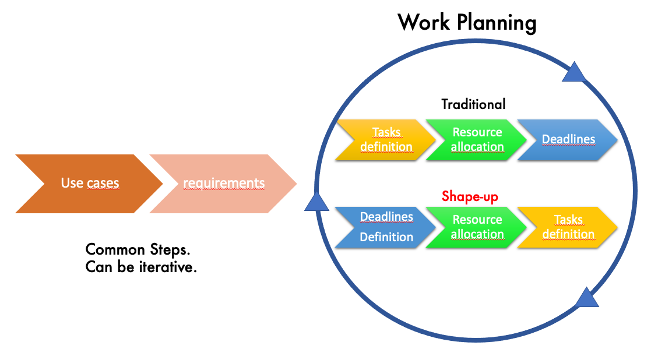
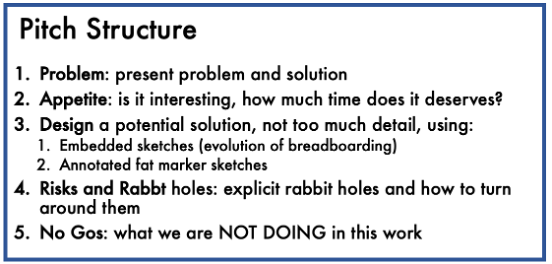

# Facing reality

There is a truth that we are all reluctant to admit: many EU funded initiatives in the research domain aim at producing software-related deliverables, but when coming to the real day-to-day work, releasing even small piece of _working_ software is very challenging. Project partners have different approaches, different technical practices, different off-the-shelf software products that need to be harmonized or sometimes divergent ideas and different cultural backgrounds. That’s the beauty and the challenge of EU initiatives. COVID-19 made things even worse by hindering the possibility of having face to face meetings, where - everybody knows but just a few people say it – agreements and decisions are taken in "social" contexts (yes, I mean coffee breaks and working dinners).

As a result, ambitious deliverables, when confronted with reality, are often re-framed to _demonstrators_ or _proof of concepts_ requiring additional work to become usable and appealing for the entire technical-scientific community they were designed for. There can be many reasons for the above not uncommon scenario, but three seems to have considerable weight: different approaches to human resources management, different technical practices, different development methods.  It is therefore a matter of finding a convergence between the software development life cycle process (Sommerville, I., 2011) and the way persons are managed.

 

# Why do deadlines slip over

Although in the latest decade Agile development methodologies (Cockburn, A., 2006) have gained popularity – and this partially makes collaborative developments easier because of a common background – still **the problem of not being able to deliver in EU initiatives exists** because when planning the developments, most methodologies are still based on workflows including the definition of tasks as the first step, and fixing deadlines at the end. The concept of _cycles_ may exist (like in the Agile method), but the sequence remains the same depicted in Fig. 1 "traditional" process.

 

\[caption id="attachment\_4572" align="aligncenter" width="672"\] **Figure 1**: T_raditional_ vs. _Shape-up_ Software development life cycles\[/caption\]

To ease the planning, Gannt charts, staff allocation charts and other models can be used. Many online and offline software exists for this, responding to the need of having a clear definition of tasks (along with the full work or through an iteration) and of estimating the amount of work required to accomplish an activity.  Although useful, they increase the work overhead in an already complex landscape like EU projects, where resources are already difficult to micro-manage and to organize internationally.

What often happens, is that definition of tasks and resources allocation is done in a very detailed way, but when it comes to deadlines difficulties are encountered because each institution in the project has its own priorities and internal organization. It is unrealistic to claim that an international group of developers, each of which is _under the control of a different organization_, can work in a harmonized way. It simply does not work. And deadlines are often not respected, with an increasing feeling of developments going on and on, with no end in sight.

 

# Is there light at the end of the tunnel? Yes.

So, is there any hope of converging towards a more efficient way of planning and managing developments? The answer is _yes_, according to the guys of basecamp ([https://basecamp.com/](https://basecamp.com/)). After years of experience in _the field_ in a cross-countries context, they elaborated a methodology called **shape-up**. It works well for private companies and can be readapted easily for research contexts.

**_Shape-up_** is described in detail in this book ([https://basecamp.com/shapeup](https://basecamp.com/shapeup)) which is free for download. It is based upon the following key concepts:

## #1 (Cyclic) Deadlines first.

Let’s be realistic. Deadlines _are_ the problem. Everybody gets excited when planning the work (I myself have plenty of detailed spreadsheets with resources allocation, lost somewhere in my laptop folders), but _actually doing_ it and respecting deadlines in a context where salaries are not strictly linked to the release of operational software, is another story. Activities are not interrupted of course, but these have troubles in producing expected deliverables in a given amount of time.

Here is where the shape-up method sounds revolutionary: _it firstly sets the deadlines._ Developers know that after a certain period they will be asked to show what they produced. This ensures that a deliverable will be there. Not respecting deadlines is a taboo. The guys of basecamp even consider dropping an activity if it produces no result in a workcycle. Fig1 "shape up" process shows the differences with the traditional way of managing the development workflow.

 

## #2 Shaping the work instead of task micro-management

Defining all tasks in advance has the advantage of clarity. However, it is a huge overhead in terms of preliminary planning and monitoring of activities while the work is ongoing. In addition, many developers cannot express their creativity because they feel like they must execute pre-defined receipts. The shape-up method does not require defining all tasks beforehand but to _shape up_ the work, that is to say, draw the boundaries of the work to be done, depict the main elements of the GUI and basic architecture, and define the no-gos or potential rabbit holes. Then it is up to the ability and creativity of small teams of developers to manage it in the given time (deadlines are fixed in advance!). Shaping-up is done by means of pitches: they are structured presentations of the proposed work that include the _problem_ that piece of work aims at solving; the _appetite_ raised by that specific development (e.g. how many cycles of developments does it deserve?); a preliminary rough _design_ with potential solutions and embedded sketches; the definition of _risks_ and _rabbit holes_ that may drain time and resources; finally the _no Gos,_ that is to say, what will not be developed in the work cycle.

 

## #3 Three steps workflow to production: Shaping, Betting, Building

Of course, a method to manage all the processes is required. And it is surprisingly straightforward. _The work is organized in work cycles_, each of which lasts from 6 to 8 weeks. But this can of course be adapted to the international research context [\[1\]](#_ftn1). The first step is _shaping the work_: senior IT together with a pool of selected developers, those who are more informed about the overall architecture, produce pitches that are coherent with the existing framework.

Then, and this is the fun part, everything is brought to a _betting table,_ a board of IT managers that based on the available resources decide what pitches deserve to be implemented. The assumption is to be realistic about available resources, and this is a very crucial step.

Finally, the _Building_ phase, representing the well-known software development phase, is done with some specific tricks that developers should use. For instance, if the software architecture includes a front-end and a back-end, the development of new features should focus on one feature at a time and work in parallel on the front and back end, against doing all front-end work and then moving to the back-end. This ensures coherent developments and that the work gets done, at least for core features.

 

\[caption id="attachment\_4574" align="aligncenter" width="552"\] Figure 2: main sections of a _pitch document_\[/caption\]

 

# Shape up in reality

The shape-up method has been tested and adapted in a real-life case, the European Plate Observing System pan-European initiative ([https://www.epos-eu.org/](https://www.epos-eu.org/)), for managing the developments of the EPOS Data portal ([https://www.epos-eu.org/dataportal](https://www.epos-eu.org/dataportal)) that include a core group of more than 20 developers, and a wider group of almost 100 developers across Europe. Some aspects had to be reviewed, for instance, the length of the work-cycles and the betting board – this required to set up a clear governance structure – but the method itself was not modified. The strongest tool is the pitching template in figure 2, which is agreed by all developers, enabled them to manage the developments. The key aspects of this use case will be the object of another post.

 

# Where the shape up does not work

Does shape up always for any context, any software development activity? Of course not.

Some cases intrinsically need a long time and a different type of stakeholders. Designing a system is an example: it requires thinking about different approaches, studying existing models, communicating with the CEO and the management layer, leveraging on existing experience and potentially communicating with external experts. In this case, the design curve can be steeper and longer in time, especially when it does not make sense to provide only _part of_ the architecture within a given timeline. Specific methodologies should be applied, but the main concepts of the shape up can still be reused.

Another case is when for any reason the availability of human resources cannot be defined _at all_ beforehand. At the end of the day, planning requires relying upon developers availability. In some sad cases, the management of IT people in EU funded projects was not tackled appropriately, just relying on voluntary work by some technical persons.

So, while being very effective for many cases and contexts, shape-up cannot yet guarantee miracles to happen. As the old proverb says “We did the possible, we are now working on the impossible. For miracles, we are gearing up!”

 

# Get in touch

We’d love to hear what you think of the proposed method and be happy to provide hints or support.

Also, we would also love to hear about your successes and challenges as you try to apply it to your teams and projects and compare experience and best practices.

Contact: Daniele Bailo [daniele.bailo@ingv.it](mailto:daniele.bailo@ingv.it)

 

# References

Cockburn, A. (2006). _Agile software development: the cooperative game_. Pearson Education.

Sommerville, I. (2011). Software engineering 9th Edition. _ISBN-10_, _137035152_, 18.

 

[\[1\]](#_ftnref1) To be honest, the basecamp guys believe that 6-8 weeks is the optimal time range for private companies. In the experiments we did in EPOS, a three-month time range was found to be more reasonable.
