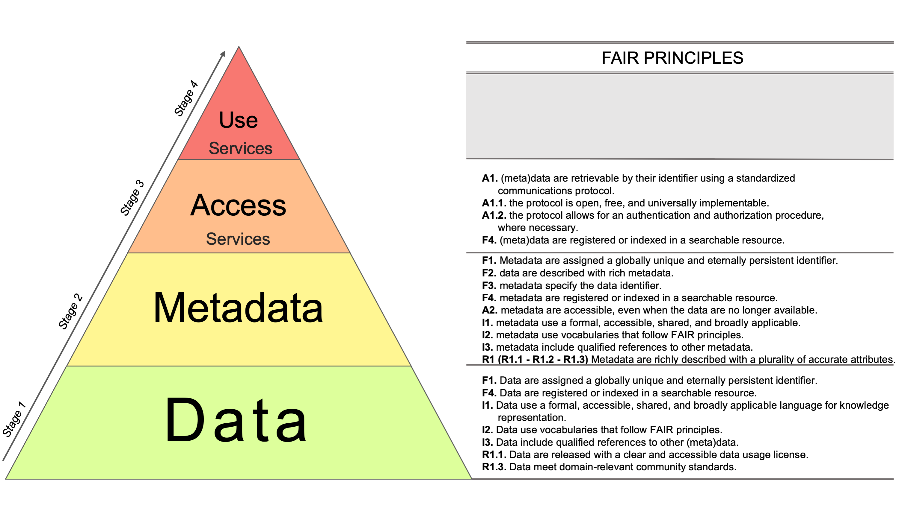

For the last few years, let us say about three, people in my field have often talked about the **F.A.I.R. principles**: loved by European officials, regarded with suspicion by computer engineers, partly approved by scientists. **These principles have a significant impact on research areas that in some way deal with data** and data sharing.

_Question_: which area of research has nothing to do with data and their distribution? _Answer_: almost none. _Logical inference_: the FAIR principles, whether we say "great!" or "alas", concern almost all researchers.

Let us therefore try to understand them better, and look at some of their characteristics. And let us try to do it simply. Anyone interested in more detailed documents can refer to [Wikipedia](https://en.wikipedia.org/wiki/FAIR_data), the [FORCE11 documents](https://www.force11.org/fairprinciples), or the [European reports](https://ec.europa.eu/info/sites/info/files/turning_fair_into_reality_0.pdf).

<!--more continua a leggere-->

## Welcome to the world, FAIR principles!

When I was a child, I had my first intellectual growth crises, the ones that push you beyond simple concepts toward a deeper understanding of reality, when I encountered the idea of a "reference date". We mention them constantly: the foundation of Rome (21 April 753 BC), the birth of Christ (25 December, year 0), the beginning of the First World War (28 July 1914). Yes, we humans need, in order to orient ourselves, to set simple reference points that let us identify a before and an after. In reality, certain processes have been simmering for a long time, and then at some undefined point: puff, they happen.


The same logic applies to the FAIR principles. The scent of FAIR had been in the air for some time, especially in the [FORCE11](https://www.force11.org/about) community. Then someone lifted the lid by writing a good article in Nature Scientific Data: "[The FAIR Guiding Principles for scientific data management and stewardship](https://www.nature.com/articles/sdata201618)". And so, on 15 March 2016, the FAIR principles were officially born.

## Nice. But what are they about?

One might be tempted to say: _"life, the universe, and everything"_. \[[Off-topic book](https://www.amazon.it/s?k=la+vita+l%27universo+e+tutto+quanto&adgrpid=52987666496&gclid=Cj0KCQjw_absBRD1ARIsAO4_D3tCc_syft3Zzcqjx3GFQCS74KIu3kZ5UtQ8iux6lNPAwEcdEDFFCwEaAlChEALw_wcB&hvadid=255188146990&hvdev=c&hvlocphy=1008736&hvnetw=g&hvpos=1t1&hvqmt=e&hvrand=13782611458205053370&hvtargid=kwd-420296793356&hydadcr=28371_1800957&tag=slhyin-21&ref=pd_sl_25ln8nu514_e), but still a good one\]. The answer is clearly playful, but it contains a grain of truth: the principles are rather general and, from the perspective of those who implement data-distribution systems, potentially ambiguous. On the other hand, they have the merit of not prescribing technologies and of leaving technical and implementation freedom. The principles tell us that data must be:

- **Findable**: searchable in their entirety;
- **Accessible**: it must be possible to access the data themselves, not only search for them;
- **Interoperable**: data interoperability, understood as the possibility for different systems to read and "understand" the data, must be ensured;
- **Reusable**: data must be structured so that they can be reused, including legal elements such as usage licenses.

> This gives us the acronym **F.A.I.R.: Findable, Accessible, Interoperable, Reusable.** A minimal set of principles to make research data consistent and reusable.

<!- -nextpage- ->

## In practice?

Everything starts from the observation that **we are overwhelmed by data and we want to use them**. But data are a bit like the inhabitants of planet Earth: saying "let us feed everyone" is beautiful, but if you give chili con carne to my grandmother, boiled cabbage to a Mexican person, and _andouillettes_ to my brother, all three of them, as in the old joke, will throw them back at you.

Having a lot of data to use is interesting, but if they are different, hard to find and process, provided in different formats and with different meanings, it is impossible to profit from them scientifically, socially, or economically. We therefore need to bring order to the jungle of data, structures, and sharing methods. Scientists and researchers have obsessions that can change life a little, for example finding recurring patterns in large amounts of data from sensors scattered around the planet. Analyze data to predict what will happen and gain an advantage. This already happens in research, for example in climate science, where analysis of atmospheric data makes it possible to identify frequent patterns and predict and circumscribe, always with a margin of error, climate oscillations or catastrophic events such as [El Nino](https://www.carbonbrief.org/extreme-el-ninos-double-frequency-under-one-point-five-celsius-warming-study). It is not science fiction, and it is widely used commercially. One of the simplest examples is heat maps: tons of data collected by companies such as Amazon that describe how services are used on websites. The data are processed to create maps of the most-clicked areas of a page, such as [Wikipedia heat maps](https://www.google.com/url?sa=i&source=images&cd=&cad=rja&uact=8&ved=2ahUKEwiBzI-R1YLlAhUCr6QKHXt1CrMQjRx6BAgBEAQ&url=https%3A%2F%2Fcommons.wikimedia.org%2Fwiki%2FFile%3AEyetracking_heat_map_Wikipedia.jpg&psig=AOvVaw0Rcr1yA09GLAFRFr8GAQqt&ust=1570280569943051 "Wikipedia page heat maps"), and then used to understand where it is convenient to place advertising banners. Fine. But if data arrive today in ASCII, tomorrow in binary format, the day after tomorrow in Excel tables, and next week in Word documents, how can we harmonize everything and feed it to software, which typically needs standardized input data? This is where the _huge intellectual and economic effort to give scientific data a rationale_ begins.

The key word for data is **machine-readable**: data must be readable by a machine, which cannot distinguish meaningfully between uppercase and lowercase, and does not know that "temperature" and "degree" may mean the same thing for researcher Arnolfo and researcher Berenice.

These and other deeper, and more serious, considerations have led to

> specifying data as a **Data Object**, that is, a triple containing: 1. the data themselves, for example a Word file; 2. the metadata; 3. a unique identifier
> 
> **Data Object <data, metadata, PID>**

So, in practical terms, producing FAIR data means making an effort to harmonize data, describe them, and design the systems that make them available, so that we have:

- common and standard data formats
- common and standard metadata formats
- unique identifiers for data and metadata that allow us to find them again
- licenses aggregated in the metadata
- defined semantic schemas that allow us to understand what data and metadata values refer to
- IT systems for accessing and searching data
- ...and other aspects we can discuss later

## Two, just two, technical details

Maybe three. If they are not interesting, you can always skip this section. By **metadata**, here we use the generic definition of "**data that describe data**".

 They are the information associated, for example, with mp3 files: artist, producer, date and time of file production. Around metadata there is a rather active community trying to identify the most suitable schemas for each field. I am thinking, for example, of [DCAT-AP](https://joinup.ec.europa.eu/release/dcat-ap/11), a specification of terms based on the W3C data catalogue vocabulary ([DCAT](https://www.w3.org/TR/vocab-dcat/)), whose purpose is to describe public data catalogues in Europe. By following this schema, there is a clear definition of what a file contains. If, at some point, I, a poor non-thinking machine that can only read files line by line and compare words with reference strings already stored in memory, read:

```
dct:title
```

then I know that whoever compiled the file, human being or another machine, is referring to the dataset title in the "dct" standard, and I can therefore make it bold, red, and centered on the page because it is a title. It is a simple and apparently banal example, but this is how things work.

Another point: when we talk about **standards** in this context, we generally refer to systems accepted by communities or standardization bodies, such as ISO, the **International Organization for Standardization**, or the [W3C](https://www.w3.org/), the inventors and "maintainers" of the web. Data in a standard format can therefore be interpreted unambiguously because their structure is known in advance.

Another important detail: the **FAIR principles are not just philosophies or an acronym; they are detailed** in order to specify them more clearly. There are therefore sub-principles for each letter of the acronym. For _Findability_ alone, we have the following, kept in English for simplicity:

- F1. (Meta)data are assigned a globally unique and persistent identifier
- F2. Data are described with rich metadata (defined by R1 below)
- F3. Metadata clearly and explicitly include the identifier of the data they describe
- F4. (Meta)data are registered or indexed in a searchable resource

I almost kept my promise. They are only three. Of course, if there are questions in the comments, we can expand.

## Are the F.A.I.R. principles really "fair"?

First of all, if you have made it this far, congratulations. You have a strong stomach. Or maybe you are simply interested in the topic. Let us therefore go a little deeper into FAIR by using a few questions. The acronym FAIR plays on the multiple meanings of the English word "fair", which also means just or equitable, suggesting that these principles are impartial.

> Let us ask ourselves: are the FAIR principles really fair? If we consider them as a minimal set of directives that can be applied to everyone, certainly yes.

If they are also applied to everyone impartially, they can create "IT ecosystems" in which all data producers are on the same level, establishing a sort of informational equity. This is a concept related to the more popular [peer to peer](https://it.wikipedia.org/wiki/Peer-to-peer).

The dream is therefore to have intelligent data-distribution centers scattered across the global network, integrating search and data-access functionality, and self-descriptive because they use standards and metadata. Then a set of agents, human or machine, would use, or in the technical English term "_consume_", these data to do whatever they want: analysis, production of new data by correlating existing data, processing, and so on.

But since the devil is in the details, as people like to say these days, we need to consider reality. It is legitimate, for example, to ask: who decides when data are "Findable"? What technical specifications can determine unambiguously the Findability of data? And again: is Findability a Boolean principle, meaning yes/no? Or are there different degrees of Findability?


Let us think together about a use case. Suppose the data in question are your photo. A nice .jpeg image of you in the Bahamas diving with a shark, uploaded somewhere.

On Facebook, on your personal blog, on the profile of some service you use, or somewhere else. When you search your name on Google, a series of results appears. Perhaps by clicking here and there you will also find your photo. So? Is your photo "findable"? _Answer:_ Yes! _Question:_ Are you sure? What if you were a machine? Wouldn't you want metadata describing that the content of the photo is really you, and not the shark? _Answer:_ um... _Pressing question:_ and if you find it, but perhaps you yourself do not have the license to use it because Facebook decides to consider all material uploaded to the social network as its own, can we say that your photo is "Accessible"? _Answer:_ um... um...

Which is the correct conclusion. Because when we go into detail, we enter a level of complexity where clear and peremptory answers become difficult unless multiple aspects of the issue are considered. Especially when talking to machines. Here I am tempted to say that [James Cameron](https://it.wikipedia.org/wiki/James_Cameron) got it right in _Terminator_, where machines are stupid and therefore relentless and inhuman. An _intelligent agent_, a networked software program, analyzing temperature data produced by your boiler connected to the _Internet of Things_ is basically a small terminator: if you do not give it the data in the format it wants, or if you do not describe them in the precise, pedantic way that only machines require, it terminates you. Click. You no longer exist. Your data make no sense. It disconnects. Poor boiler. It keeps working anyway, relentless too, since it was programmed to run until the gas runs out or someone closes the valve.

Data are therefore FAIR also as a function of the precision and detail with which their FAIRness is assessed.

> The more the definition of FAIR is shared, technically meaningful, and not subject to interpretation, the more the principles will be applicable fairly to everyone.

## Why have they been successful?

At this point, it is legitimate to ask why the principles summarized by the acronym FAIR have been successful. Thinking about it, history could have gone differently. For example, best practices and implementation rules for open data could have been expanded further. Or interoperability, as computer engineers conceive it, and metadata for research could have been better explained and promoted. Other paths were possible, but events instead led us to the F.A.I.R. principles. Why?

There are considerations on different levels. **From a communication point of view**, the FAIR principles work very well. The acronym is easy to remember and has this additional meaning of "equitable", suggesting rules that can be applied equally and fairly. **From the endorsement point of view**, they have had the support of important people and research centers. So it is the usual story: if a farmer from Velletri says it is going to rain, we listen and maybe bring the laundry inside, just to be safe. But if Colonel Bernacca says it, for those who do not know or remember him, see his fantastic [weather forecast video](https://www.youtube.com/watch?v=CUzEiwI6YgU) after Hurricane David in 1979, then it is law carved in marble. **From the funding point of view**, the principles have become a fundamental criterion for the European Union, especially for funding H2020 projects in the European Open Science Cloud area, acronym EOSC, which has [great ambitions](https://it.wikipedia.org/wiki/European_Open_Science_Cloud) and a [certain degree of complexity](https://ec.europa.eu/research/openscience/index.cfm?pg=open-science-cloud). And therefore, _ca va sans dire_, all projects now require that when data are used, produced, or managed, these activities follow FAIR.

## The current state: FAIR principles and reality

The principles are fascinating. But to make the vision tangible, it must be brought down into reality.

It is extremely difficult to summarize the reality of European public research data briefly and rigorously. Certainly not in this post. But one very general consideration can be made: data produced by public administration and research in Europe form a large jungle in which people are trying, with effort, to bring order by implementing appropriate policies, thinking about infrastructure sustainability, creating cross-fertilization of skills, funding cluster projects, and so on.

So, in practice?

From an engineering and IT point of view, it is not easy to provide directives because Europe is always very inclusive and tries to find a balance that respects everyone's needs.

But it is clear that, on several fronts, there are now people willing to get their hands dirty and openly state what needs to be done technologically to implement the FAIR principles.

Europe has also been active, both by publishing documents such as [Turning FAIR into reality](https://ec.europa.eu/info/publications/turning-fair-reality_en), the report of the Commission FAIR Data Expert Group, and by opening funding channels to support initiatives such as [GO-FAIR](https://www.go-fair.org/) and [ENVRI-FAIR](http://envri.eu/envri-fair/). Outside Europe, there are also other initiatives, including [FAIRSharing.org](https://fairsharing.org/).

The greatest difficulty is not only defining, clearly but also generically and inclusively, systems that distribute FAIR data. It is also using an approach that can be understood by data managers and research leaders, who often have scientific backgrounds outside computer science.

The client-server architecture, which an undergraduate computer science student can explain even in extreme situations, for example if woken up in the middle of the night with a bucket of water while someone shouts "give an example of a client-server protocol with handshaking!" \[cit. Renato Spigler, my Analysis professor at university\], is not something that biologists, philosophers, and others can digest easily. **It needs to be blended, homogenized, packaged, and sold well.** **That is why we thought of the FAIR pyramid.**

## The FAIR pyramid and peace of mind

Our working group found itself exactly at the intersection of the scientific and technical domains, where principles become reality, having to work on this FAIR mess. Now that we have a few years of experience developing a fully FAIR-compatible architecture in the [EPOS](http://www.danielebailo.it/epos-integrated-core-services-architecture-basics-tutorial/) project, we decided to create something digestible. A sort of FAIR antacid.

**It is the FAIR pyramid.**

\[caption id="attachment\_3668" align="alignnone" width="3000"\][](https://www.frontiersin.org/articles/10.3389/feart.2020.00003/full) From the article: [Perspectives on the Implementation of FAIR Principles in Solid Earth Research Infrastructures](https://www.frontiersin.org/articles/10.3389/feart.2020.00003/full) DOI: https://doi.org/10.3389/feart.2020.00003\[/caption\]

The pyramid describes a common approach used by scientists and by those who work daily on data and systems, based on four levels:

1. _data level,_
2. _metadata level,_
3. _access level,_
4. _(re)use level._

**Data are usually the main activity and the main asset of scientists and data professionals in research infrastructures.** Consequently, the first conceptual step for every scientist is to worry about data: formats, structure, description, and so on (Level 1). Once data are properly managed, the conceptual challenge of describing and identifying them is usually addressed, in order to create the premises for search and contextualization (Level 2). Once data are properly managed, described, and contextualized through metadata, the next problem is how to make them accessible to users (Level 3). There is then a fourth level, which goes somewhat beyond the FAIR principles and deals, for example, with data analysis and processing. This opens interesting scenarios, summarized by the question: how can a processing service ensure that FAIR input data produce output products that are still FAIR?

Having established that, in the context of researchers and research infrastructures, the approach is based on these four phases, the exercise we carried out was to reshuffle the order of the FAIR principles and assign them to each of the four levels of the pyramid. In this way, it will be easier for those who need to implement the FAIR principles to understand at which level they need to act when designing or upgrading a system.

## The End

In short, FAIR comes at the right time in an age when we are submerged by data and where, especially in public and research contexts, we need to bring some order in order to realize the vision of an internet of data where information is truly accessible and analyzable at large scale (Big Data).

Implementing FAIR, however, is truly complicated when it has to be done for real, getting one's hands dirty with code, data, metadata, and system architectures.

To make things a little easier, we produced this pyramid, in which the principles are associated with more clearly defined activities.

Now comes the next step: who will try to apply them and produce truly FAIR data?

We leave the question open... waiting for another post on the topic, whose focus and contents can be influenced by leaving a comment below.

## Acknowledgements

Images in this post were provided courtesy of [pxhere](https://pxhere.com/)

- Baby & Computer [https://pxhere.com/en/photo/1250101](https://pxhere.com/en/photo/1250101)
- Gears [https://pxhere.com/en/photo/818429](https://pxhere.com/en/photo/818429)
- Header img: [https://pxhere.com/en/photo/1451251](https://pxhere.com/en/photo/1451251)
- Bahamas Shark img: [https://pxhere.com/en/photo/496028](https://pxhere.com/en/photo/496028)

\[jetpack\_subscription\_form subscribe\_text="enter your email"\]
