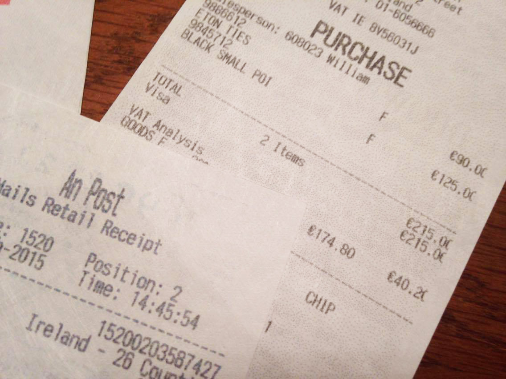
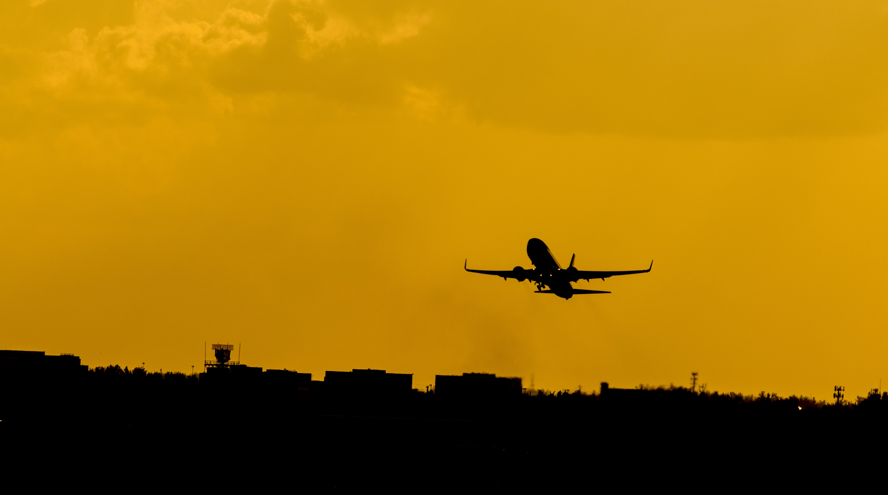
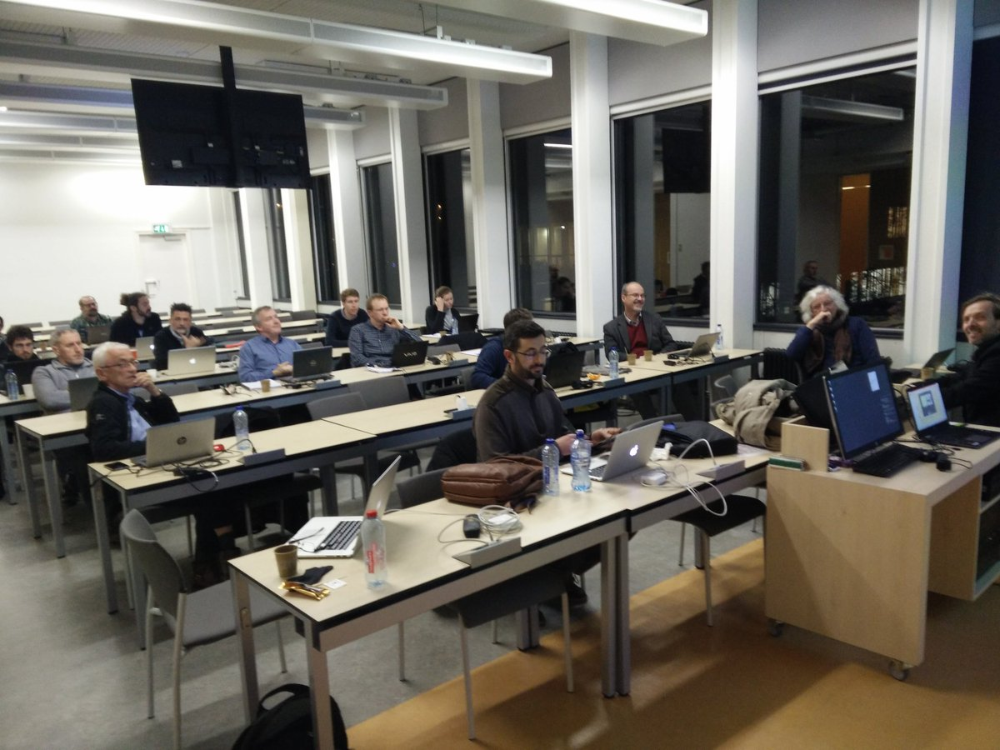
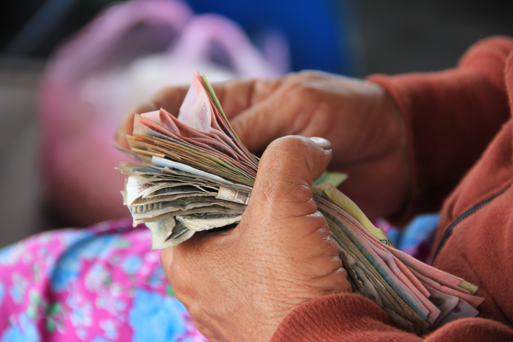

I recently returned from Edinburgh, a city that, besides being rainy and picturesque, hosted a conference on Virtual Research Environments, a topic obscure to most people and, above all, impossible to explain to my grandmother when she asks: "What do you talk about at these meetings?" Now, when I say "grandmother", do not make the mistake of imagining a meek, dazed ninety-five-year-old. She is simply the spearhead of a generation that has lived through, and grown stronger through, war, 1968, the economic boom, Canale 5, Mike Bongiorno, soap operas, and Young Signorino. She is sharp, always ready with an answer, impossible to deceive, skilled at outmaneuvering others, and hard to bend to anyone's will. Basically, a bulldozer. These are the people they should make films about. Robocop and Marvel superheroes look like timid newlyweds by comparison.

<!--more-->

Although I am proud to descend from such tough ancestors, I must have some inner weakness and host, unknowingly, a form of original sin. The Italian state looks at me with suspicion, as a potential perpetrator of repeated embezzlement against it and against taxpayers' pockets. Therefore, with paternal care, it implements every strategy to prevent me from falling into temptation and assuming the sad status of state parasite. Right. Well done.

\[gallery ids="3343,3344" type="rectangular" link="none"\]

I had confirmation of this once again when, after returning from Edinburgh, I carried out the so-called "mission closure", meaning the final paperwork needed to receive reimbursement for money advanced from my own pocket. It is the last step in a complex thief-proof procedure involving many passages. Removing the most boring ones and skipping details for insiders, I can summarize the process as follows:

_a) Recovering the mission form:_ this means obtaining the form to fill out in order to receive permission to go on a mission. Be careful, however: there is a different one for each section of the institution, and the form does not correspond to the section you belong to, but to the one managing the funds that finance your mission. It is strange and a little complex. It took me years to understand, but never mind, I have time: I am a public employee. The forms are located in an internal virtual area, the intranet, which luckily can be accessed through an easy-to-remember address such as http://intranet.sede.questoente.it/?q=node/88/index.php. From there, one can conveniently navigate through a hundred links to the forms page of the relevant section, where, among a list of forty different forms randomly ordered and identified by acronyms familiar to everyone, for example "Form E/intranet - request for purchase of inventoriable goods", one selects the mission form. Ah, no, I forgot. There are actually three forms: mission in Italy, mission abroad, request for overtime during mission. For each, I can have either the editable Word file or the non-editable PDF. The latter is dedicated to naive people who enjoy printing the sheet and filling it in with a blue pen, usually spilling beyond the available spaces marked by insufficient black lines, with consequent rejection of the file. Amateurs. This also confirms the theory that the invention of PDF was commissioned by SISDE from a satanic sect formed by former INPS employees.

Of course, all the forms contain the same information, but differ in essential elements that invalidate submission, such as the section logo and the font size of the footnotes. I publicly admit that I tried to be clever and, after the first fifteen missions, tired of spending ten minutes searching for the right form, I saved the file on my computer. Wrong. Forms change from time to time, maybe once every ten years or once a week, and the saved copy I had laboriously filled in had become obsolete. I had to start over. Patience. I have time, because as everyone knows, public employees do practically nothing, and it is therefore right that the little work assigned to them be long, tedious, and traceable through lengthy bureaucratic chains certified by stamped sheets of paper archived in cardboard folders tied with cotton tape and usually buried in the institution's dungeons, in case an audit ever comes. Damn right. At least these public employees do something.

_b) Filling in the mission form._ This phase is complicated. The form has several parts to complete with declarations and requests that must be put in black and white, for example "prior request pursuant to Ministerial Decree MAE of 23/3/2011, published in Official Gazette no. 132 of 9/6/2011 concerning mission settlement procedures". But I do not complain about this. I remember very well when, at thirteen, I went with my father to the post office and he taught me how to fill in a payment slip. It seemed difficult and inhuman, then I understood how it worked and got used to it. It is a moment I remember fondly, but in fact it was the first dose of bureaucracy to which I later became addicted. A pity: the habit of these administrative torments robbed me of the amazement felt by children, researchers, and psychiatrists in front of the complex perversion of the human mind.

_c) Delivering the mission form._ When I began this new career after coming from another research institution, I immediately realized the complexity of the previous steps, but I trusted that once the form had been obtained and filled in, the road would be downhill. I was harshly brought back to reality when I realized that the form required: the signature of the section director, the signature of the fund manager, and prior approval of the expense by the competent offices. As everyone knows, sheets of paper do not have legs. This means that the file, rightly included in the set of sheets of paper, must be accompanied by me to the various offices where I can collect the precious signatures and authorizations. It is not that once I reach the office I can obtain a signature on the spot, of course. Depending on the case, I must speak with a secretary, leave the file and retrieve it the next day, or wait for a while for something behind the door to happen and then still leave the file and collect it the next day. Of course, it is a bit of a waste of time, but this is right and I must not dare complain, because as a public employee I have nothing particular to do, apart from coordinating an international working group for the development of an innovative infrastructure for sharing Earth-science data, which I can evidently do in spare moments while transporting files from one office to another.

_c.1) Special cases_: I cannot omit, and I say this clearly and at length, since as a ministry employee I have all the time I want to write in detail things that I could summarize in two lines, or most often in one word or even a syllable such as "yes" or "meh", that there are special cases in which public employees also volunteer. This does not include classic activities with disabled or elderly people, categories whose meekness and benevolence are overestimated by those who do not spend time with them, but rather doing good for colleagues and the institution without receiving additional recognition. This happened in my section, where an employee unknown to me, true humility indeed, computerized the mission bureaucracy together with the section director. I am lucky: I save the ten minutes needed to search for the form and the half day spent hunting for signatures. Unfortunately, the computerized procedure can be used only when the funds are hosted by the section to which one belongs, and that is almost never my case. Patience. I will keep doing my rounds. I have time.

_d) The mission, finally._ The actual mission is the moment when the state rightly watches most carefully with its paternal gaze. And rightly so. Think how many crimes and sins it has spared me. A dense series of rules attempts to cut off at the root every possibility of defrauding or fattening oneself at the taxpayers' expense. One therefore lives the mission anxiously, constantly thinking about keeping every receipt for itemized reimbursement, rather than with the freedom of mind needed to focus on complex topics discussed in international conferences in a language other than one's own, usually English, in conversation with brilliant minds from all over the world. At dinner, one must draw on all communication and linguistic skills to explain to restaurateurs across Europe that each person at a table of ten needs a separate receipt, otherwise the institution's offices might frown and cancel the reimbursement. One must bear, with embarrassment, the gaze of foreign colleagues who receive a generous daily allowance and do not feel castrated by suffocating rules. They look at me with amazement. Some perhaps with pity or solidarity. One must also remember that one can spend at most around sixty euros per day in total for two meals. This if one is a researcher. Technicians can reach only forty euros. It goes without saying that for missions in Denmark or Norway, technicians have three options: 1) eat only breakfast, taking a cappuccino and croissant for thirty euros, and use the remaining ten to buy mints; 2) fast all day and at dinner order a beer, vegetable couscous, cabbage or aubergines imported from Italy, and a dessert, usually indigestible cheesecakes are popular; 3) pack bread, jam, and tins of mackerel for dinner, and use the forty euros for a full breakfast including orange juice.

Back home, the potential state parasites arrive at the office on Monday morning with envelopes full of receipts, boarding passes, hotel invoices, and bus tickets, ready to demonstrate the expenses incurred and finally close the mission. At first I found this step difficult, perhaps the hardest of the whole chain. This happened because, blinded by greed, I expected to recover all expenses and, even worse, with senses clouded by arrogance, I wanted to understand the meaning of the endless steps and categorizations I was and still am required to perform. Fortunately, I understood the two keys to surviving the process psychologically intact.

The first is to forget one's nature as a human being and convince oneself one is an automaton. Once I entered this state of mind, I was surprised to see myself calmly collecting and categorizing receipts, copying amounts spent by hand from one sheet to another, stapling receipts one by one while highlighting dates, searching for and attaching boarding passes, adding up the total of validated bus tickets, and reconstructing with colleagues the food and drinks consumed per person by subtracting them from the single receipt of that evening when, alas, we failed to communicate to the waiter that we wanted eleven separate invoices.

The second key was the discovery of a special, precious sheet. It is called the "mission report" and is the place where I can self-certify, under my own responsibility, everything that the diligent bureaucrat, guided by the wise hand of the legislator, was unable to foresee. I used it, for example, the last time when at 11:00 PM we had to return to the hotel after a dinner based on British fatty matter, I do not remember whether pork shank, fried butter, or something else. In theory we should have taken the bus, because the costly temptation to take a taxi could have swollen our pride and must rightly be avoided at all costs: taxis are only for exceptional cases, says the rule. Even in England, where taxis are ridiculously cheap and, if taken by three or more people, certainly convenient. In reality, we were exhausted after a day of travel and hours of conference, so after a quick hotel check-in we rushed to dinner before everything closed. I spent my last strength booking an Uber taxi on my smartphone, total cost 7.46 pounds. The mission report saved me, where I declared that "due to road disruptions in the streets adjacent to the route from the hotel to the restaurant, which caused a limitation of bus services during the day and their complete suspension from 9:00 PM GMT, the undersigned was forced to use a taxi for a total cost of pounds 7.46." I think the offices are becoming suspicious, because in the evening the streets were disrupted also during my missions to Amsterdam, Utrecht, Bergen, and Canicatti. But I am safe, both because I self-certified and because one of the secretaries is from Canicatti and always complains about potholes and poor public transport in that metropolis.

Just yesterday, in one of the many moments when, as the ministry employee I am, I had nothing to do, apart from answering the 92 emails received that day, writing two abstracts, completing two deliverables, coordinating with the German colleague on the conversion of metadata from nine communities for a total of about ten terabytes of incomprehensible data, holding a couple of teleconferences to manage the creation of web APIs, responding to the online consultation on FAIR principles launched by the European Open Science Cloud, continuing the pending article, and other entirely secondary tasks, I reflected on the loving care the legislator has for my soul, and I was moved. I was shaken deeply. Nothing but paternal and selfless love toward me could push him to spend so much energy preventing even the remotest possibility that I might steal.

Taking an average between southern and northern European countries, on mission I will spend around 50 euros per day on meals and another 20 on buses or taxis, when my soul turns toward Evil and wastefulness. Including travel expenses to and from the departure and arrival airports, I will roughly reach a daily expense of 80 euros. Let us exaggerate: 85.

So, our survival while traveling costs the state 85 euros per day. Actually the state does not pay, Europe does, because these are European funds. But never mind. It rightly watches so that I do not declare excessive expenses, say 100 euros per day, which happens to be the flat-rate allowance my Dutch colleagues receive without having to fill in any form. But no, no. I do not even want to think about it. I am glad there is a reliable authority that takes care to verify the declared expense in detail, rather than risk spending even one extra euro that might end up in the pocket of a state parasite. In this way my conscience is clean, and the dark tree of disobedience to the seventh commandment casts its shadow far from me.

Unfortunately, as everyone knows, Evil always whispers into the ears of pure souls like mine, souls that do not steal while on mission. Following this sinister line of reasoning, I began wondering how much these immeasurable spiritual fruits cost the state.

I did some calculations and realized that my net hourly pay is about 11 euros per hour. Degrees, PhDs, and specializations have always guaranteed wealth and luxury, as everyone knows. I then discovered that, by following the full mission procedure, I spend: ten minutes recovering the mission form, twenty filling it in, an hour and a half delivering it and collecting signatures, and two hours closing it. That makes about four hours, equivalent to roughly 44 euros.

Unfortunately, I am not the only one working on my mission. There are also the secretaries, who in ordinary cases spend an hour checking receipts and verifying that the amount to be committed is available, at a total cost to the state of about 10 euros; the section director, who on average spends a good twenty minutes reading, signing, and resolving frequent disputes, with an estimated total cost of 5 euros; and the fund manager, who must consider whether the mission is justified and thoughtfully add his signature, but he takes only ten minutes: 3 euros. To this calculation I add a special indicator I call the attention span factor, meaning the time burned following the mission. The operations I perform to complete the bureaucratic process, instead of being consecutive and condensed into a single time slot, are scattered here and there throughout the day, forcing me on one hand to interrupt the secondary tasks for which I am responsible, such as contributing to the writing of a six-million-euro project that will fund my salary and that of my precarious colleagues, and on the other to bring my attention back to the important bureaucratic tasks and understand where I was in the process. Conservatively, I can quantify the attention span factor at about an hour and a half per mission. Approximate total cost: 16 euros.

What emotion, what surprise, what feeling of inner warmth, when I realize that the state spends almost 80 euros per mission to defeat the potential parasite living inside me.

Only an ear stubbornly listening to the malicious whisper could conjecture that, instead of throwing 80 euros into bureaucracy easily circumvented through self-certifications, inflated restaurant receipts, and blank taxi receipts filled in by oneself, it would be possible to provide a flat daily allowance of 100 euros and be done with it. Moreover, using basic mathematics, one can verify that for missions of four days or less, which are the majority, it would be cheaper for the state to provide a flat 100-euro daily allowance than to continue sustaining the current mad process of documented reimbursement. Not to mention that at least five people would be relieved of monkey work and perhaps would be less frustrated.

But I will certainly not fall into the diabolical trap set by these empty and specious reflections. On the contrary, I consider myself lucky, and my days are now always full of effervescent activities: missions keep me busy, and the memory of this paternal, benevolent affection from the authoritarian and anonymous governor makes even those empty moments happy and dense, moments in which I, a public research employee, would otherwise not know what to do.

_Note 1:_ _all the photos, except the one with the bundle of money, show state parasites at work. As you can see, with the money we give them they take free holidays and indulge in_ immoral amusements.

_Note 2:_ _I would like to express a sadly posthumous thanks to Umberto Eco and his book "How to Travel with a Salmon", which inspired this post._

Header Photo by [jesse orrico](https://unsplash.com/photos/h6xNSDlgciU?utm_source=unsplash&utm_medium=referral&utm_content=creditCopyText) on [Unsplash](https://unsplash.com/search/photos/archive?utm_source=unsplash&utm_medium=referral&utm_content=creditCopyText)
