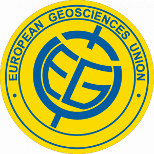
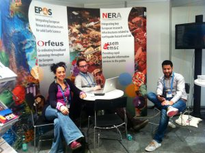
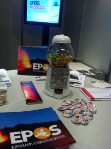
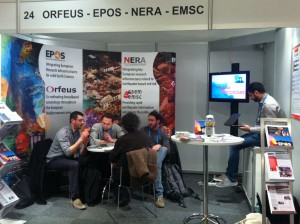
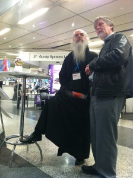

I have various friends and acquaintances outside my work circle with whom I often end up talking about my activities. Every time, surprisingly, I discover how hard it is to explain what happens at these conferences or meetings I sometimes attend.

Having already given up on answering the fatal question "_what do you do for a living?_" when asked by non-specialists over 70, I now try to explain how a congress such as [EGU](http://www.egu2013.eu/) works. I once tried saying: "I work in [EPOS](http://www.epos-eu.org/), a European project dealing with the integration of research infrastructures for Earth sciences; now I work on metadata collection for the creation of a catalogue that will allow data discovery and integration." The result was bewildered looks, mechanical "ah, interesting" replies, and other scenes I will spare you.

<!--more-->Maybe one day I will manage to explain what I do before uttering the magic word "earthquakes". Very indirectly, one could say that I also work on that. Very indirectly. Very.

So, this year too I am attending EGU. **What is EGU?** It is the [European Geoscience Union](http://www.egu2013.eu/) General Assembly. In practice, **it is a huge congress, around 30,000 people**, where scientists working on **Earth sciences** meet to discuss new discoveries, compare the state of the art in specific disciplines, show their work, and build contacts. In all academic environments, periodic meetings are held so people can tell each other what they are doing and understand where the field is going. If this congress must be classified, it belongs in that broad category of _academic meetings_.

Throughout the day there are presentations on **many Earth-science topics**: from seismology to energy and the environment, from hydrology to computer science applied to systems for storing and sharing data. There are many of them: _from 8:30 in the morning until 8:00 in the evening, there are more than 60 parallel presentations every fifteen minutes and more than 800 posters presented every day._ **A quick back-of-the-envelope calculation: 2,880 oral presentations per day.**

In short, it is a huge mess, and when you arrive you need to pick up the program, a 300-page booklet, to understand which sessions interest you.

Within this congress, I work on the _"IT part"_ of an Earth-science project, let us call it that without going into details that are hard to digest for non-IT people. This year, as last year, I move among three things: 1. the project booth, 2. internal meetings and congress sessions, 3. the poster presentation.

### The project booth

\[caption id="attachment\_262" align="alignleft" width="300"\] EPOS Booth Team\[/caption\]

I like to call it _"the barber shop"_. Although it was created as a place to provide information about the project and its ongoing initiatives, it often turns into a place where people come to grab the available gadgets: pens, very cool brochures, pins, and this year even M&Ms with a custom logo.

\[caption id="attachment\_253" align="alignright" width="224"\] the gadgets\[/caption\]

They then stop to consume our time as well. They get enthusiastic, come over, tell you what they do, narrate their life story, and explain that they can predict earthquakes without error. When asked where these miraculous abilities come from, they reply with the innocent clarity of a child still playing with Barbie dolls: they have rigorous scientific models. In other words, pure fantasy.

Just like in a barber shop, idle people of various kinds stop by to tell stories, acquaintances arrive needing a table on which to place their laptop and check email, and people looking for friendship seek the human contact that only we at EPOS, oozing Italian warmth from every pore in this cold northern-European setting, joking, can give them.

In the photo next to this paragraph, you can see a historic moment: several ICT people, including me, meet to discuss the functional diagram of a system for storing, staging, PID-ing, and managing seismological data and metadata.

After so much IT solitude, I finally found myself with other extremely competent people with whom I could discuss and learn. We managed to develop a shared vision and agree on the next steps. As far as I am concerned, I will work with other colleagues from [INGV](http://www.ingv.it/it/) on a prototype for storing seismological data and metadata based on [CouchDB](http://couchdb.apache.org/) or other NoSQL databases. Very cool, in short.

### Meetings and sessions

The various meetings and sessions, the ones held in batches of 60 in parallel, are very interesting. In the former, people mostly discuss family business, meaning internal project matters. For example: volcanologists are building a node that will distribute data and services to EPOS, so they need to meet face to face and agree on how to build it, which data to share, who should receive them, how to distribute them, and so on.

I imagine all this may seem almost superfluous to an external observer, but the reality is that when you try to do something with others, especially in science, everyone approaches the problem from their own background, and it usually takes time to define the subject. Even when discussing purely IT topics, scientific issues often emerge, and hours of persuasion, comparison, brainwashing, lobotomy, and other extreme methods may be needed to clarify that, at that moment, the question is simply: "do you want to share the data with everyone or only with the colleague next door?"

The sessions, instead, are the so-called _oral talks_, where people present the results of their work, often connected to a scientific publication. Today I listened to a fantastic one by the Google people. But that deserves [a separate post](http://danielebailo.wordpress.com/2013/04/13/google-il-rocco-siffredi-della-tecnologia-egu2/ "Google: il Rocco Siffredi della tecnologia (EGU#2)").

Before that, I leave you with a little gem: the photo below.

See you later.
