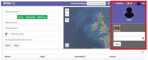

_(This article was originally written for VRE4EIC Newsletter. Follow [this link](https://www.vre4eic.eu/publications/press-releases/171-enhancing-research-infrastructures-with-vre4eic-components-the-epos-success-story) to the original source)._

 

> The European Plate Observing System (EPOS) highlights how its research infrastructure has become more efficient and user friendly by utilizing technology developed in the frame of the EU H2020 VRE4EIC project.

In the last decades quite an amount of tools, technologies and software has been developed to support and improve research throughout the entire data lifecycle[\[1\]](#_ftn1). This includes software, modeling tools, and even code that can be used and re-used by researchers around the world. However, more and more emphasis has been given to the structural components that enable a Research Infrastructure[\[2\]](#_ftn2) to be sustainable, robust and, even most importantly, compliant to the FAIR principles[\[3\]](#_ftn3). Such principles prescribe--in order to enable reproducible science--that data need to be findable, accessible, interoperable and reusable. It is usually up to research infrastructure designers, developers and managers to find the best architecture and technologies to enable FAIR to become reality in their scientific domain. However, looking transversally at science domains, it is clear that there is a number of challenges common to several communities, as evidenced by the common requirements elicitation and analysis of existing technical assets carried out both in the VRE4EIC and ENVRIplus project[\[4\]](#_ftn4).

> _In this framework, VRE4EIC is promoting the adoption of common, standard technical solutions in order to facilitate  Research Infrastructures in facing shared challenges and thus complying with FAIR principles._

This is the case of the European Plate Observing System (EPOS), a Distributed Research Infrastructure long-term plan to facilitate integrated use of data, data products, and facilities from distributed research infrastructures for solid Earth science in Europe.

<!--more-->

In order to enable accessibility (the “A” of FAIR), the EPOS central hub, that provides access to a wealth of different types of data and services from communities, had to implement appropriate Authorization mechanisms. Such mechanisms are usually referred to as “AAAI”, which stands for Authentication, Authorization, and Accounting Infrastructure. Instead of creating such an infrastructure “from scratch”, EPOS took advantage of the existing VRE4EIC “AAAI Service”[\[5\]](#_ftn1) building block. This component provides a “plug-and-play” solution for the authentication of users, and in addition it integrates different authentication mechanisms from various AAI providers (e.g. EDUGAIN, Facebook, Google and others) in one single system. Due to its integrability into service-based architecture, it can be easily plugged into micro-services-oriented architectures[\[6\]](#_ftn2), such as the one of EPOS.

_**Figure** **1**: Example of integration of VRE4EIC Authentication services (AAAI) into EPOS central hub Graphic User Interface (GUI). The login box is rendered on the EPOS GUI, but actually managed and ran by VRE4EIC Authentication service building block. Such component is part of the VRE4EIC prototype and runs on VRE4EIC servers made available by project partners (in this case CNR ISTI – Pisa)._

 

The EPOS User Interface is presented in Figure 1. It enables the discovery and search of datasets in the solid Earth domain, which includes several communities such as Seismology, GPS, satellite data, volcanic observatories and others. An authentication widget is also available for access to specific dataset. The authentication in this case is managed by the VRE4EIC AAAI service component, that is simply “plugged-in” into EPOS main system.

Starting from this first pilot, EPOS has also benefitted from VRE4EIC studies and developments in other fields. For instance for the workflow management and the metadata system architecture (both projects use the CERIF[\[7\]](#_ftn1) model).

The EPOS use case has several important implications. The first one is that this pilot has demonstrated the suitability of the strategy adopted by VRE4EIC for supporting and enhancing e-Research Infrastructures, in particular with respect to the AAAI service.

The second one, related to research infrastructure sustainability, is that it saved efforts in integrating authentication services on EPOS, with all related technical and security issues, not to counting the development efforts that were optimized by adopting an EU-funded solution.

Third, on the user side, it allows end users to access through existing credentials from Facebook, eduGAIN, and other Identity Providers, to log in easily to EPOS or any other Research Infrastructure enhanced by VRE4EIC Authentication service.

Now, a future-oriented exercise is due: imagine that many other research infrastructures would use such shared solutions produced by VRE4EIC. How much development and sustainability efforts would they save by integrating in an easy way metadata catalogue services, AAAI services, and other common solutions?

The answer is not trivial, also because other players are available on the EU landscape. However, the expertise brought in by a pool of scientist and engineers in VRE4EIC, strongly connected with the communities, and with skills in the integration of several research infrastructures in various domains, is doubtless precious and capable of optimizing the technical dimension and sustainability, as demonstrated by the EPOS pilot.

 

[\[1\]](#_ftnref1) For an overview of the Data Lifecycle see https://www.dataone.org/data-life-cycle

[\[2\]](#_ftnref2) Definition of Research Infrastructure by EU funding body https://ec.europa.eu/research/infrastructures/index.cfm?pg=about

[\[3\]](#_ftnref3) M. D. Wilkinson et al., “The FAIR Guiding Principles for scientific data management and stewardship,” Sci. Data, vol. 3, p. 160018, 2016.

[\[4\]](#_ftnref4) “ENVRIplus is a Horizon 2020 project bringing together Environmental and Earth System Research Infrastructures, projects and networks together with technical specialist partners to create a more coherent, interdisciplinary and interoperable cluster of Environmental Research Infrastructures across Europe”. “Theme 2” deliverables report an overview of common elements and requirements in the various Environmental Research Infrastructures http://www.envriplus.eu/deliverables/

[\[5\]](#_ftnref1) More information about the VRE4IEC AAAI building block can be found here https://www.vre4eic.eu/images/Public\_deliverables/D3.3\_Building\_Blocks.pdf

[\[6\]](#_ftnref2) A extensive compendium about Microservices architecture and techniques can be found in _S. Newman, Building Microservices. O’Reilly Media..._

[\[7\]](#_ftnref1) CERIF stands for Common European Research Information Format, see [https://www.eurocris.org/cerif/main-features-cerif](https://www.eurocris.org/cerif/main-features-cerif) and [https://www.eurocris.org/eurocris\_archive/cerifsupport.org/cerif-in-brief/index.html](https://www.eurocris.org/eurocris_archive/cerifsupport.org/cerif-in-brief/index.html)
