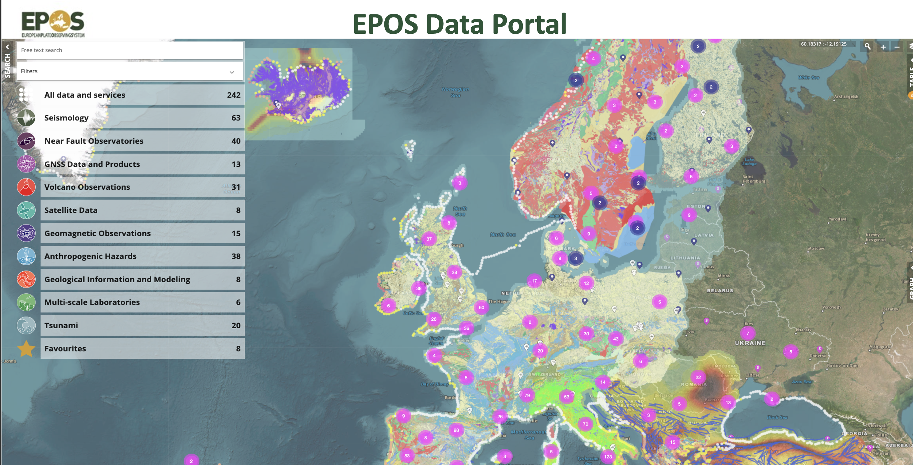

> Nel mese di Novembre 2023 è stato pubblicato su [Nature Scientific Data](https://www.nature.com/articles/s41597-023-02697-9), un articolo scientifico che presenta il lavoro di Data Integration e Computer Science che, insieme ad un team di colleghi davvero bravi, ho effettuato negli ultimi 10 anni. L'articolo presenta un'iniziativa che sta cambiando il modo in cui affrontiamo la ricerca scientifica sulla Terra in Europa: il [Portale Dati EPOS](https://www.ics-c.epos-eu.org/). In questo post, vi racconterò in modo accessibile cosa rende questa piattaforma multidisciplinare così speciale.

[European Plate Observing System (EPOS)](https://www.epos-eu.org/) non è solo un'iniziativa internazionale; è una visione che sta ridefinendo il campo della scienza della Terra in Europa. Questa infrastrutture di ricerca pionieristica ha costruito un ambiente collaborativo unico, dove la condivisione e l'utilizzo dei dati scientifici sono incoraggiati, sostenuti e curati nel minimo dettaglio. L'[Open Data](https://www.forumpa.it/pa-digitale/open-data-cosa-sono-come-sfruttarli-e-stato-dellarte-in-italia/) , nel suo spirito più puro, permette a tutti - scienziati, politici, esperti e cittadini - di accedere liberamente alle informazioni. Grazie all'adesione ai principi [FAIR](https://www.go-fair.org/fair-principles/) (Findable, Accessible, Interoperable, Reusable), EPOS sta diventando un punto di riferimento in Europa, simbolo di un accesso aperto e interoperabile ai dati. Questo approccio  non solo apre nuove porte alla conoscenza, ma è anche un passo fondamentale verso una ricerca scientifica più inclusiva, collaborativa e innovativa

Il ruolo del [Il Portale Dati](https://www.ics-c.epos-eu.org/) è cruciale: è il cuore pulsante di un'ambiziosa impresa che sta cambiando il panorama della ricerca scientifica. Questa piattaforma rappresenta una vera rivoluzione nell'integrazione, accesso e utilizzo dei dati scientifici della Terra. La sua forza risiede nella **natura multidisciplinare, che permette di aggregare dati da oltre 250 fonti diverse**, offrendo una vista panoramica della Terra come mai prima d'ora. Questa caratteristica straordinaria trasforma il Portale Dati in un luogo dove ricercatori, scienziati e professionisti di varie discipline possono accedere a un vasto patrimonio di informazioni, ma anche collaborare e creare nuove sinergie. In questo modo, il Portale Dati EPOS va oltre la semplice piattaforma di dati, per diventare un incubatore di idee e scoperte, che contribuisce in modo significativo alla nostra comprensione del pianeta Terra.

**All'inizio questa impresa sembrava impossibile.** Dati così diversi come mappe, liste di file, forme d'onda, ognuna con i suoi formati diversi, con standard di accesso diversi. Il sogno di creare un portale sembrava pura utopia. Ma la continua ricerca di soluzioni innovative ha dato infine i suoi frutti su varie dimensioni: innanzitutto dal punto di vista tecnico, in cui è stata adottata una architettura distribuita innovativa; in secondo luogo dal punto di vista della comunità, composta da circa 1000 persone, che include scienziati, sviluppatori, ingegneri, computer scientist, esperti di dati, manager... messi assieme attraverso una intensa attività di riunioni, community building e adozione di approcci innovativi come lo [shape-up.](https://www.danielebailo.it/job/the-agile-shape-up-method-for-collaborative-developments-in-international-contextsa-lean-approach-for-epos/) Infine, la continua attività a livello europeo per garantire la sostenibilità dell'infrastruttura tramite partecipazione a progetti e iniziative europee. 

[L'architettura del Portale Dati EPOS](https://link.springer.com/chapter/10.1007/978-3-031-39141-5_20) costituisce la base su cui poggia questa innovativa **piattaforma open-source.** Oltre a ispirarsi a principi che sono lo stato dell'arte quando si tratta di architetture multi-tier, come ad esempio l'approccio a microservizi, essa implementa in un singolo sistema innovativo tre prinicipi chiave: a) utilizzo di metadati ricchi e basati su standard, che permettono di descrivere le risorse al sistema centralizzato lasciando, allo stesso tempo, la proprietà e la gestione dei dati completamente sotto la responsabilità dei fornitori di dati; b) accesso ai dati basato su servizi, permettendo di concentrare in un unico hub centrale - il Portale EPOS appunto - risorse distribuite sull'intero continente europeo; c) l'utilizzo della semantica che consentendo di attribuire significato e contesto ai dati e di informare il sistema centrale riguardo a come i dati devono essere integrati sulla mappa.

**Come [piattaforma open-source](https://epos-eu.github.io/epos-open-source/),** il Portale Dati EPOS apre le porte all'innovazione e alla collaborazione e rende disponibile  alla comunità mondiale di sviluppatori un software sviluppato in a 10 anni di esperienza nel campo dell'integrazione dei dati nelle scienze della terra solida, non solo da sviluppatori software ma da tutta comunità scientifica coinvolta in modo attivo, che ha contribuito a definire le caratteristiche e le funzionalità del Portale, garantendo che risponda alle esigenze reali degli utenti.

**Per la comunità scientifica** Il Portale Dati EPOS rappresenta una risorsa preziosa che semplifica l'accesso e l'uso dei dati  della scienza della Terra per studi multidisciplinari. Esso infatti consente di visualizzare in maniera combinata dati come mappe di rischio, terremoti nell'ultimo mese, faglie attive in una specifica regione, immagini da satellite che evidenziano lo spostamento verticale della superficie terrestre. Questa integrazione di dati multidisciplinari permette di ottenere una visione completa dei rischi sismici nella regione, aiutando a capire i processi che generano fattori di rischio che possono causare disastri naturali, quali terremoti o eruzioni vulcaniche.

**Per i politici** e i decision maker, i dati multidisciplinari possono,  sul lungo termine, costituiscono un aiuto nel prendere decisioni informate per la sicurezza e la pianificazione territoriale.

**Il Portale Dati EPOS è destinato a crescere ulteriormente**. La direzione è quella dello sfruttamento dei **Big data** con tecniche di **Machine learning e AI**. Sono infatti previsti sviluppi che includono l'espansione delle funzionalità del portale per consentire l'analisi, l'elaborazione e la visualizzazione avanzate dei dati scientifici. Questo aprirà nuove opportunità per la scoperta scientifica e l'innovazione.

[L'articolo su Nature Scientific Dat](https://www.nature.com/articles/s41597-023-02697-9)a rappresenta solo l'inizio di una rivoluzione nella scienza della Terra portata avanti dal [Portale Dati EPOS](https://www.ics-c.epos-eu.org/). Questa piattaforma trasforma il modo in cui accediamo e utilizziamo i dati, aprendo nuove porte per la ricerca e la collaborazione. Immaginate un futuro in cui scienziati, politici e cittadini attingono a questa vasta risorsa per affrontare le sfide del nostro pianeta, per conoscere accedere a mappe geologiche o di pericolosità sismica, per cercare di capire se la casa che stanno comprando sarà sicura sul lungo termine. Con l'espansione verso tecniche di Machine Learning e AI applicate ai Big Data integrati nel portale, EPOS si prepara a guidare gli scienziati verso scoperte potenzialmente rivoluzionarie. Questo viaggio appassionante è quello di tutti, scienziati, esperti e semplici cittadini, verso una comprensione più profonda del nostro mondo e del nostro pianeta.

 

Quali sono le vostre impressioni sul ruolo del Portale Dati EPOS nella scienza della Terra? Ci sono aspetti che vi incuriosiscono o che desiderate approfondire? Vi invito a lasciare i vostri commenti e domande qui sotto, per arricchire il dialogo su questo argomento.
