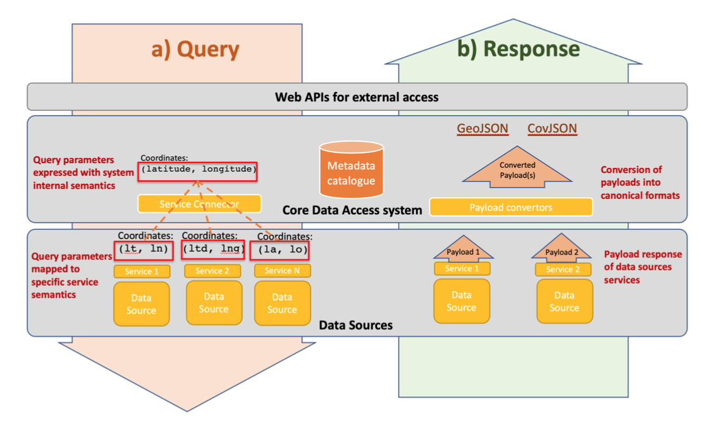

 

I'm thrilled to share my latest paper titled "I[ntegrated access to multidisciplinary data through semantically interoperable services in a metadata-driven platform for Solid Earth Science.](https://link.springer.com/chapter/10.1007/978-3-031-39141-5_20)" This paper delves deep into the innovative approach of combining metadata, semantics, and web services to achieve seamless data interoperability.

A key discovery highlighted in the paper is the pivotal role of semantics at the data discovery level. The queries received by the main data integration system are mapped to specific queries using the semantic information associated with the data source. This ensures that data from various sources can be visualized in a unified format, enhancing the user experience. [Link to the paper for detailed insights](#)

Furthermore, web services are dynamically adapted based on the data source to be integrated. The integration system interoperates with data sources implementing different web services, with details about these services stored, including their semantic information.

Looking forward to your thoughts and feedback on this groundbreaking approach. Let's discuss and collaborate!
