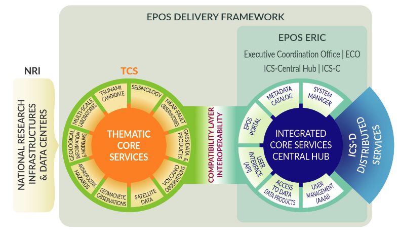
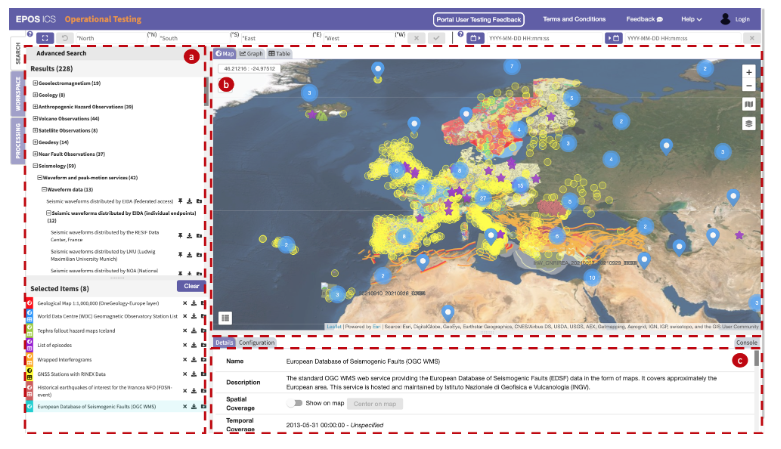
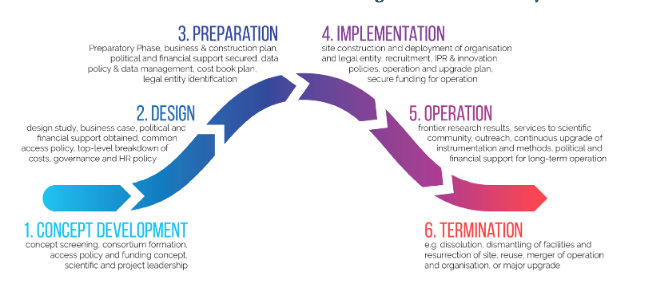
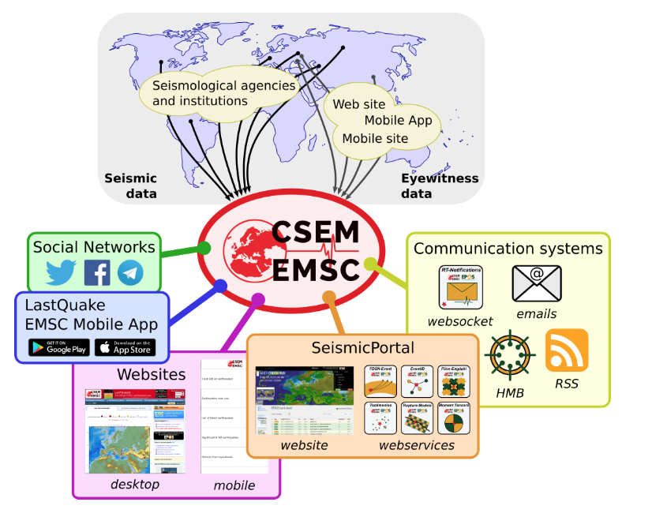

I have been often asked by people outside of my domain what is my job.

As many jobs in the IT domain, it is a little bit difficult to explain what we do: it is quite technical and abstract. It has to do with structures that do not exist in reality. It has to do with planning, with considering sustainability of the envisaged activities. We work with bits, code, data structures, metadata, with management of huge IT objects and initiatives.

Even most importantly, as EPOS is something completely new, it has much to do with setting up architectures and methodologies which do not exist yet. Most of the effort is dedicated to making things real on the basis of what discussed and decided in a collaborative way, rather than carrying out activities that are well established and tested since years.

So, not sure whether I can now answer straight to the  burning question "Daniele, what's your job".

However, everybody can now have a comprehensive overview of what EPOS is and what this wonderful enterprise, which has become a legal entity (an [ERIC](https://ec.europa.eu/info/research-and-innovation/strategy/strategy-2020-2024/our-digital-future/european-research-infrastructures/eric_en)), is about with the "[Special Issue: EPOS a Research Infrastructure in solid Earth: open science and innovation](https://www.annalsofgeophysics.eu/index.php/annals/issue/view/590)" from the [Annals of Geophysics](https://www.annalsofgeophysics.eu/index.php/annals) journal.

In particular, I would like to highlight four publications that are vital for understanding what EPOS is (and what is my job, hopefully :) )

## 1\. THE EPOS RESEARCH INFRASTRUCTURE: A FEDERATED APPROACH TO INTEGRATE SOLID EARTH SCIENCE DATA AND SERVICES

**This paper is an introduction to EPOS and provides an overall view of the initiative.**

 

**Abstract.** The European Plate Observing System (EPOS) is a Research Infrastructure (RI) committed to enabling excellent science through the integration, accessibility, use and re-use of solid Earth science data, research products and services, as well as by promoting physical access to research facilities. This article presents and describes the EPOS RI and introduces the contents of its Delivery Framework. In November 2018, EPOS ERIC (European Research Infrastructure Consortium) has been granted by the European Commission and was established to design and implement a long-term plan for the integration of research infrastructures for solid Earth science in Europe. Specifically, the EPOS mission is to create and operate a highly distributed and sustainable research infrastructure to provide coordinated access to harmonized, interoperable and quality-controlled data from diverse solid Earth science disciplines, together with tools for their use in analysis and modelling. EPOS relies on leading-edge e-science solutions and is committed to open access, thus enabling a step towards the change in multidisciplinary and cross-disciplinary scientific research in Earth science. The EPOS architecture and its Delivery Framework are discussed in this article to present the contributions to open science and FAIR (Findable, Accessible, Interoperable, and Reusable) data management, as well as to emphasize the community building process that supported the design, implementation and construction of the EPOS RI.

_Cocco M, Freda C, Atakan K, Bailo D, Saleh-Contell K, Lange O, Michalek J. The EPOS Research Infrastructure: a federated approach to integrate solid Earth science data and services. Ann. Geophys. \[Internet\]. 2022Apr.29 \[cited 2022May9\];65(2):DM208._

 

 

## 2\. DATA INTEGRATION AND FAIR DATA MANAGEMENT IN SOLID EARTH SCIENCE

**This paper describes the technical implementation of EPOS also with reference to the FAIR principles.**

**Abstract.** Integrated use of multidisciplinary data is nowadays a recognized trend in scientific research, in particular in the domain of solid Earth science where the understanding of a physical process is improved and made complete by different types of measurements – for instance, ground acceleration, SAR imaging, crustal deformation – describing a physical phenomenon. FAIR principles are recognized as a means to foster data integration by providing a common set of criteria for building data stewardship systems for Open Science. However, the implementation of FAIR principles raises issues along dimensions like governance and legal beyond, of course, the technical one. In the latter, in particular, the development of FAIR data provision systems is often delegated to Research Infrastructures or data providers, with support in terms of metrics and best practices offered by cluster projects or dedicated initiatives. In the current work, we describe the approach to FAIR data management in the European Plate Observing System (EPOS), a distributed research infrastructure in the solid Earth science domain that includes more than 250 individual research infrastructures across 25 countries in Europe. We focus in particular on the technical aspects, but including also governance, policies and organizational elements, by describing the architecture of the EPOS delivery framework both from the organizational and technical point of view and by outlining the key principles used in the technical design. We describe how a combination of approaches, namely rich metadata and service-based systems design, are required to achieve data integration. We show the system architecture and the basic features of the EPOS data portal, that integrates data from more than 220 services in a FAIR way. The construction of such a portal was driven by the EPOS FAIR data management approach, that by defining a clear roadmap for compliance with the FAIR principles, produced a number of best practices and technical approaches for complying with the FAIR principles.

Such a work, that spans over a decade but concentrates the key efforts in the last 5 years with the EPOS Implementation Phase project and the establishment of EPOS-ERIC, was carried out in synergy with other EU initiatives dealing with FAIR data. On the basis of the EPOS experience, future directions are outlined, emphasizing the need to provide i) FAIR reference architectures that can ease data practitioners and engineers from the domain communities to adopt FAIR principles and build FAIR data systems; ii) a FAIR data management framework addressing FAIR through the entire data lifecycle, including reproducibility and provenance; and iii) the extension of the FAIR principles to policies and governance dimensions.

_Bailo D, Jeffery KG, Atakan K, Trani L, Paciello R, Vinciarelli V, Michalek J, Spinuso A. Data integration and FAIR data management in Solid Earth Science. Ann. Geophys. \[Internet\]. 2022Apr.29 \[cited 2022May9\];65(2):DM210._

 

## 3\. LONG-TERM SUSTAINABILITY OF A DISTRIBUTED RI: THE EPOS CASE

**This paper describes the approach of EPOS to sustainability, and remarks the importance of the community building process.**

**Abstract.** The European Plate Observing System (EPOS) is a Research Infrastructure (RI) committed to enabling excellent science through the integration, accessibility, use and re-use of solid Earth science data, research products and services, as well as by promoting physical access to research facilities. This article presents and describes the EPOS RI and introduces the contents of its Delivery Framework. In November 2018, EPOS ERIC (European Research Infrastructure Consortium) has been granted by the European Commission and was established to design and implement a long-term plan for the integration of research infrastructures for solid Earth science in Europe. Specifically, the EPOS mission is to create and operate a highly distributed and sustainable research infrastructure to provide coordinated access to harmonized, interoperable and quality-controlled data from diverse solid Earth science disciplines, together with tools for their use in analysis and modelling. EPOS relies on leading-edge e-science solutions and is committed to open access, thus enabling a step towards the change in multidisciplinary and cross-disciplinary scientific research in Earth science. The EPOS architecture and its Delivery Framework are discussed in this article to present the contributions to open science and FAIR (Findable, Accessible, Interoperable, and Reusable) data management, as well as to emphasize the community building process that supported the design, implementation and construction of the EPOS RI.

_Saleh Contell K, Karlzén K, Cocco M, Pedersen HA, Atakan K, Bailo D, Lange O, Mercurio D, Maracchia G, Piras D, Sangianantoni A, Fredella M, Freda C. Long-term sustainability of a distributed RI: the EPOS case. Ann. Geophys. ._

## 4\. COORDINATED AND INTEROPERABLE SEISMOLOGICAL DATA AND PRODUCT SERVICES IN EUROPE: THE EPOS THEMATIC CORE SERVICE FOR SEISMOLOGY

**This paper describes how the EPOS Seismological community is organized for a unified and comprehensive provision of seismological data, products ad services at European Scale.**

**Abstract.** In this article we describe EPOS Seismology, the Thematic Core Service consortium for the seismology domain within the European Plate Observing System infrastructure. EPOS Seismology was developed alongside the build-up of EPOS during the last decade, in close collaboration between the existing pan-European seismological initiatives ORFEUS (Observatories and Research Facilities for European Seismology), EMSC (Euro-Mediterranean Seismological Center) and EFEHR (European Facilities for Earthquake Hazard and Risk) and their respective communities. It provides on one hand a governance framework that allows a well-coordinated interaction of the seismological community services with EPOS and its bodies, and on the other hand it strengthens the coordination among the already existing seismological initiatives with regard to data, products and service provisioning and further development. Within the EPOS Delivery Framework, ORFEUS, EMSC and EFEHR provide a wide range of services that allow open access to a vast amount of seismological data and products, following and implementing the FAIR principles and supporting open science. Services include access to raw seismic waveforms of thousands of stations together with relevant station and data quality information, parametric earthquake information of recent and historical earthquakes together with advanced event-specific products like moment tensors or source models and further ancillary services, and comprehensive seismic hazard and risk information, covering latest European scale models and their underlying data. The services continue to be available on the well-established domain-specific platforms and websites, and are also consecutively integrated with the interoperable central EPOS data infrastructure. EPOS Seismology and its participating organizations provide a consistent framework for the future development of these services and their operation as EPOS services, closely coordinated also with other international seismological initiatives, and is well set to represent the European seismological research infrastructures and their stakeholders within EPOS.

_Haslinger F, Basili R, Bossu R, Cauzzi C, Cotton F, Crowley H, Custodio S, Danciu L, Locati M, Michelini A, Molinari I, Ottemöller L, Parolai S. Coordinated and Interoperable Seismological Data and Product Services in Europe: the EPOS Thematic Core Service for Seismology. Ann. Geophys._
